# Delivery, AWS architecture, and data lifecycle

## Status and reading order

**Branch sequence:** `feature/<user> → integration → dev → prod`.

Contributor work starts as a localhost-compatible application. The first merge needs no Terraform or AWS compatibility. Later gates require the AWS deployment contract, then production UI coverage and deployment evidence.

| Status | Meaning in this document |
|---|---|
| Implemented in this PR | Workflow, script, or Terraform behavior exists in this repository |
| Proposed setting | A JSON file describes a GitHub setting; it does not install that setting |
| Not deployed | No successful AWS deployment has been verified for this repository |
| Not implemented | The architecture has no corresponding resource or application capability |

**Access enforcement is blocked.** GitHub returned HTTP 403 for rulesets and branch protection on this private repository. The response requires a plan upgrade. The environment list is empty. An organization owner must enable the required GitHub capabilities and install the settings before inviting contributors.

The current authenticated account has repository-admin permission but only organization-member status. `yifrankliu` is a verified organization owner with repository-admin permission. The proposed review settings and `CODEOWNERS` use that account.

Read sections 1–5 for Actions and permissions; sections 6–12 for AWS, website operation, and data; section 13 for bootstrap.

## 1. Contributors enter through local checks

Each arrow across a shared branch requires a PR and an owner merge. Passing checks does not authorize a contributor to merge. The controller never merges or synchronizes branches.

`feature/<user>` is a naming convention, not a parent-child Git relationship. Create it from current `integration`. Git cannot store both a branch named `feature` and branches named `feature/user`; this is why the shared local branch is `integration`.

Branches do not change code automatically to make it cloud-compatible. AWS-specific changes return through a contributor branch when the Dev gate fails.

Source: [stage workflows](../.github/workflows/), [`ci_policy.py`](../scripts/ci_policy.py), [`promote.py`](../scripts/promote.py).

## 2. Organization rules restrict shared-branch writes

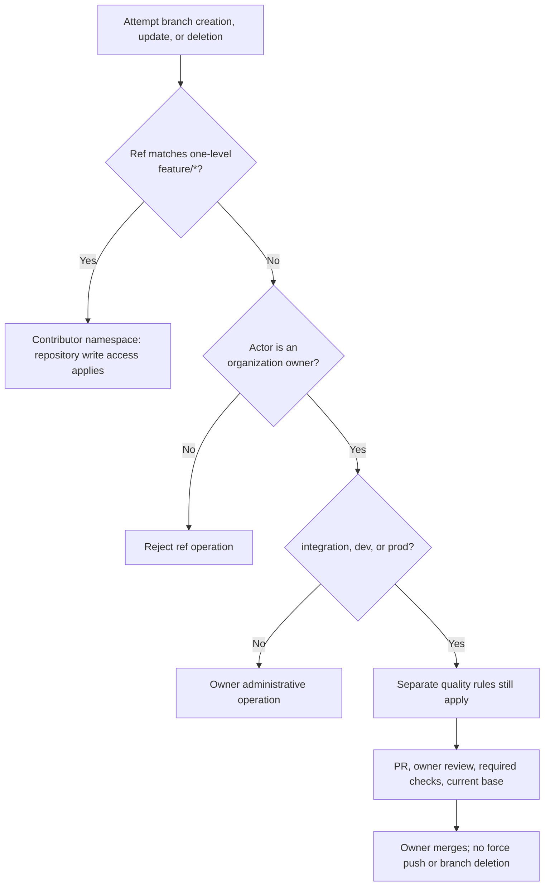

This diagram describes **proposed organization rules**, not active enforcement. Rules target only `club-res-website`.

| Setting | Purpose | Bypass |
|---|---|---|
| `contributor-namespace.org-ruleset.proposed.json` | Restrict creation, update, and deletion of every branch outside `feature/*` | Organization owners only |
| `integration.org-ruleset.proposed.json` | Require Intake, PR review, and current base | None |
| `dev.org-ruleset.proposed.json` | Require Dev checks, PR review, and current base | None |
| `prod.org-ruleset.proposed.json` | Require Production checks, PR review, and current base | None |
| `.github/CODEOWNERS` | Require the verified owner to review all changed files | Governed by quality rules |
| Environment proposals | Restrict deployment ref and require owner approval | Admin bypass disabled |

An organization rule prevents repository admins from removing the restriction locally. Do not grant rule-editing organization roles to contributors. The restriction has no repository-admin, deploy-key, or GitHub Actions bypass.

The namespace rule permits contributors to use any allowed `feature/*` branch. It does **not** prove that `feature/alice` belongs to Alice or prevent another writer from updating it. Personal branch isolation would require per-user rules or separate forks.

Contributors need repository **write**, not admin, access. Names cannot restrict local branches or branches in another repository. Fork PRs are outside the implemented Intake route.

Scheduled Dependabot updates were removed: its generated branch names would violate this namespace. Dependency updates use a reviewed `feature/<user>` branch instead. A bot exemption would need a separate policy decision.

GitHub references: [organization ruleset API](https://docs.github.com/en/rest/orgs/rules#create-an-organization-repository-ruleset), [repository ruleset API](https://docs.github.com/en/rest/repos/rules#create-a-repository-ruleset).

## 3. Each stage adds a specific compatibility requirement

| Requirement | Intake: contributor → integration | Dev: integration → dev | Production: dev → prod |
|---|---|---|---|
| Frontend | Locked install, lint, dependency audit, ordinary build | Same checks plus `frontend/out/index.html` static export | Same checks plus required `test:ui` |
| Backend, when present | Fast pytest suite, excluding `slow` | Full pytest suite | Full pytest suite |
| Container image | None | Build, scan, import smoke for backend changes | Same for backend changes |
| Terraform | **Not installed or validated** | Format, validate, mocked plan tests | Same checks repeated |
| Source scanning | Workflow lint, secrets, Python audit/code scan when present | Adds configuration misconfiguration scan | Same checks repeated |
| Cloud credentials during verification | None | None | None |
| Deployment after merge | None | Dev account, environment `dev` | Prod account, environment `prod` |
| Missing frontend | Can be no-work if no frontend exists | Blocks executable changes | Blocks executable changes |
| Missing AWS bindings | Not relevant | Blocks deployment | Blocks deployment |
| Backend deployment | Not relevant | Blocks backend runtime releases: host not implemented | Same restriction |

Intake does not require Docker, static export, Terraform, or cloud credentials. A Terraform-only Intake change still gets secret scanning but no Terraform compatibility gate.

Dev and Production check all non-image lanes for every non-documentation change. The image lane requires a backend path change. Ship runs retain these checks; they do not replace verification with a build-only shortcut.

Documentation-only changes skip application and Terraform lanes and do not deploy. Renaming application code into `docs/` does not qualify for the controller's documentation-only deployment exception.

### Event routing

| Workflow | Trigger/ref | Operation |
|---|---|---|
| Intake | Push `feature/*`; manual run on that ref; same-repository PR into `integration` from `feature/*` | Verify local contract |
| Dev | Push/manual `integration`; PR into `dev` from `integration` | Verify AWS compatibility; no AWS credentials |
| Dev | Push/manual `dev` | Recheck, build artifact, deploy dev if executable changes exist |
| Production | Manual `deliver` on `dev`; PR into `prod` from `dev` | Verify strict production contract |
| Production | Push/manual `deliver` on `prod` | Recheck, build artifact, deploy prod if executable changes exist |
| Production | Manual `plan` or `apply` on `prod` | Infrastructure only, target `dev` or `prod` |
| Promotion | Successful completion of Intake, Dev, or Production | Evaluate trusted run evidence; prepare PR or dispatch verification |

Unsupported refs and PR source branches fail routing. New contributor pushes and PR runs can cancel older checks. Deployment runs do not cancel an active deployment.

### Selected checks converge at one gate

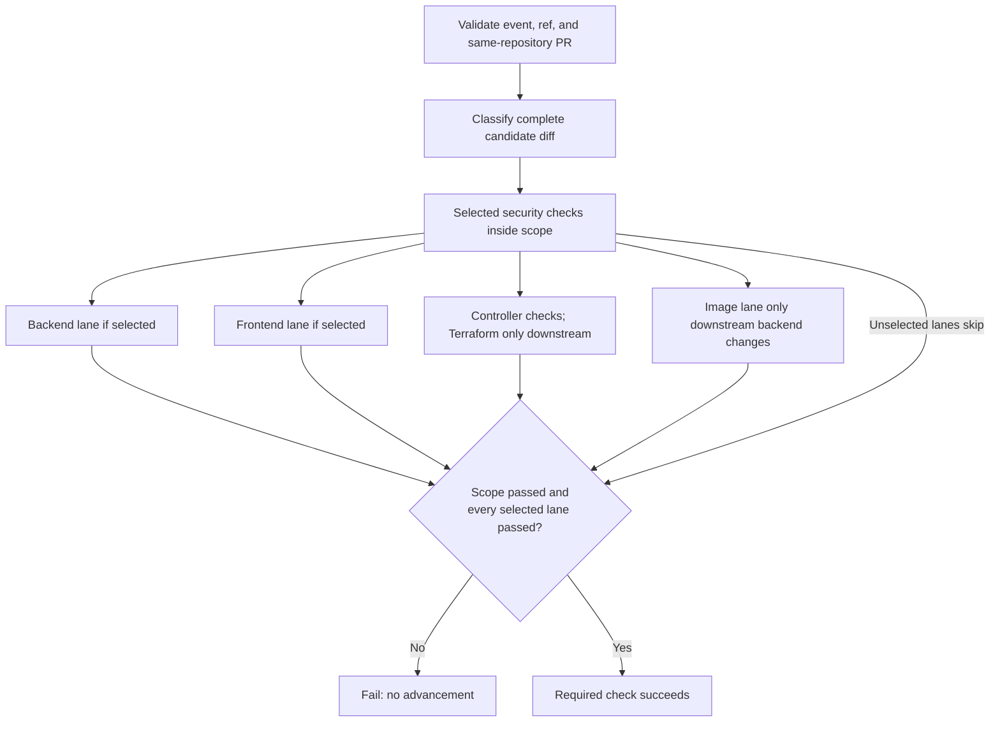

Verification compares the complete candidate with its destination branch, not only its latest push. Shipping compares the push range, or the first parent on manual delivery.

Source: [`ci_policy.py`](../scripts/ci_policy.py), [composite actions](../.github/actions/).

## 4. Trusted completion code prepares PRs, never merges

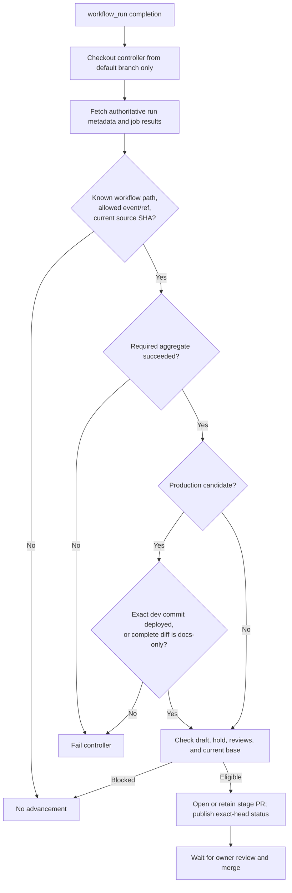

The controller has write permissions because it creates PRs, statuses, and production releases. It never checks out candidate code, runs candidate scripts, or downloads candidate artifacts.

A successful Dev deployment dispatches Production verification on `dev`. The Production candidate must have a successful Dev deployment job for its exact SHA, unless the complete `prod…dev` diff contains only documentation.

The Production required check enforces this evidence too. Opening a production PR manually does not bypass the deployment prerequisite.

Hold labels are `hold`, `do-not-merge`, and `release:hold`. Drafts, requested changes, recently closed unmerged candidates, stale source heads, and branches behind their destination stop advancement. Oversized evidence pages fail closed or stop automatic advancement.

GitHub-generated PR events do not reliably start workflows when the controller uses `GITHUB_TOKEN`. Source pushes already perform Intake and Dev verification. The controller explicitly dispatches Production verification and publishes the verified status on the exact PR head.

Owner review remains essential: contributor code can modify its own proposed checks. Protected shared refs, CODEOWNERS, and organization rules form the enforcement boundary, not workflow names alone.

A successful production deployment creates a semantic-version release for the **deployed SHA**, not the controller checkout SHA. Documentation-only changes create no deployment release. Repeating a release reuses the existing release for that commit.

Source: [`promotion.yml`](../.github/workflows/promotion.yml), [`promote.py`](../scripts/promote.py), [`release_version.py`](../scripts/release_version.py).

## 5. Deployment fails closed before publication

This approval step exists only after the GitHub environment protections have been installed. A YAML environment name alone does not enforce review.

| Evidence | Contract |
|---|---|
| Package | `club-site-<commit SHA>` contains `site.tar.gz` and `SHA256SUMS` |
| Retention | GitHub retains the site artifact for 3 days |
| Integrity | Deploy checks both the frontend job's expected hash and the manifest |
| Account | AWS credentials action restricts the allowed account ID |
| Revision | Public `index.html` must match the packaged file byte-for-byte |
| Production prerequisite | Successful Dev deployment job for the exact candidate SHA |

Dev and Prod build separately. Hash checking proves integrity within a run; it does not prove identical bytes across accounts.

The live check covers the index only. It does not prove every route, dependency, authorization rule, or browser interaction. Required production UI tests must supply that application coverage.

Publication is not atomic. A failure after S3 writes can leave some new content live. There is no automatic rollback.

Source: [`frontend/action.yml`](../.github/actions/frontend/action.yml), [`ship/action.yml`](../.github/actions/ship/action.yml).

## 6. Two AWS accounts isolate deployment targets

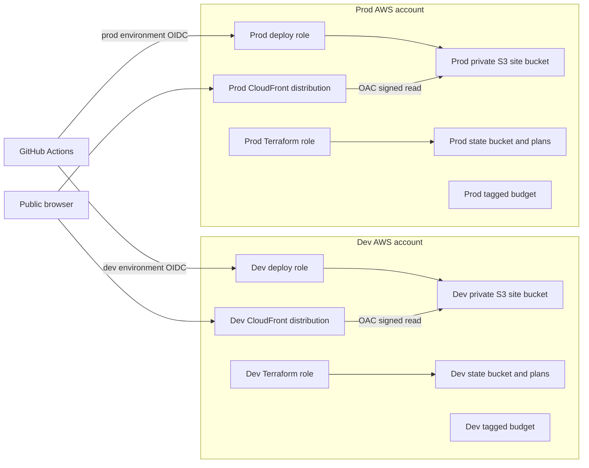

This is the Terraform design, not evidence that these accounts or resources have been created. The state buckets and account structure require bootstrap outside this stack.

Dev is a separate deployment, but its CloudFront URL is **public**. Account isolation does not make a static dev site confidential. Use synthetic or public data there.

| AWS feature | Design choice and consequence | Source |
|---|---|---|
| Separate accounts | Distinct resources, state, roles, and cost tracking; no shared runtime data path | Environment inputs in [`main.tf`](../terraform/main.tf) |
| S3 origin | Private regional S3 endpoint; not S3 public website hosting | [`main.tf`](../terraform/main.tf), [`cloudfront.tf`](../terraform/cloudfront.tf) |
| CloudFront | Global HTTPS static delivery, compression, HTTP/2 and HTTP/3, IPv6 | [`cloudfront.tf`](../terraform/cloudfront.tf) |
| Origin Access Control | CloudFront signs origin requests with SigV4 | [`cloudfront.tf`](../terraform/cloudfront.tf) |
| CloudFront Function | Rewrite clean paths to exported HTML; no application server | [`cloudfront.tf`](../terraform/cloudfront.tf) |
| Managed cache policy | `Managed-CachingOptimized`; deploy controls object cache headers | [`cloudfront.tf`](../terraform/cloudfront.tf), ship action |
| Managed response headers | `Managed-SecurityHeadersPolicy`; not a substitute for application-specific CSP | [`cloudfront.tf`](../terraform/cloudfront.tf) |
| IAM OIDC provider | Short-lived AWS sessions, exact repository/environment trust | [`github.tf`](../terraform/github.tf) |
| Role separation | Site publisher versus privileged reviewed Terraform operator | [`github.tf`](../terraform/github.tf) |
| S3 state locking | Terraform 1.10+ S3 lockfile; no DynamoDB table | [`main.tf`](../terraform/main.tf) |
| SSE-S3 and versioning | Encryption at rest and recoverable replaced objects | [`main.tf`](../terraform/main.tf) |
| Lifecycle | Noncurrent history expiration, multipart cleanup, delete-marker cleanup | [`main.tf`](../terraform/main.tf) |
| AWS Budgets | Email notices for tagged actual and forecast spend | [`budget.tf`](../terraform/budget.tf) |

No VPC, NAT gateway, EC2, ECS, Lambda application backend, database, WAF, or customer-managed KMS key exists in this stack. A static public site does not need an always-on server.

## 7. Browsers receive a static website, not a Node server

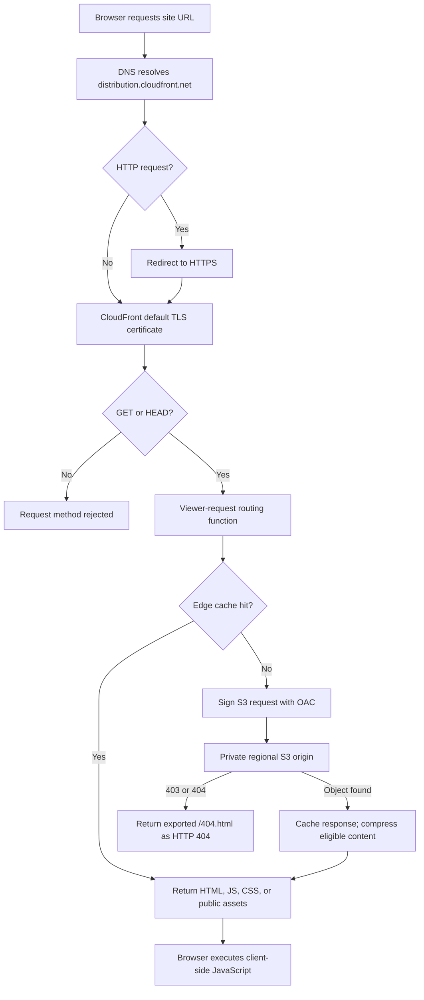

Node runs during CI builds, not in AWS at request time. The application must support Next.js `output: 'export'` downstream. Server-side rendering, API routes, server actions, and server-side sessions have no host here.

| Request path | Origin path |
|---|---|
| `/` | `/index.html` |
| `/about` | `/about.html` |
| `/docs/` | `/docs/index.html` |
| `/_next/static/file.js` | Unchanged |
| Unknown key | Custom 404 response; requires an exported `404.html` |

The route function distinguishes paths using a trailing slash or a dot in the last path segment. Application route design must fit that rule. It does not implement authorization or API routing.

CloudFront uses `PriceClass_100` to limit edge-location cost exposure. This is a geography/performance tradeoff, not a monthly cost cap. No geographic access restriction is configured.

### Custom domain is a separate, not-yet-implemented change

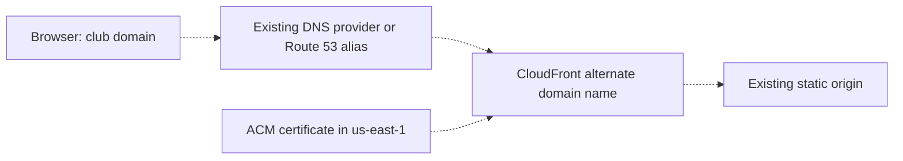

Dashed arrows describe a planned extension only. The current Terraform has no aliases or ACM certificate. A custom domain needs certificate validation, DNS, aliases, and a reviewed TLS policy change. DNS can remain with an existing provider.

## 8. OIDC separates code checks from AWS permissions

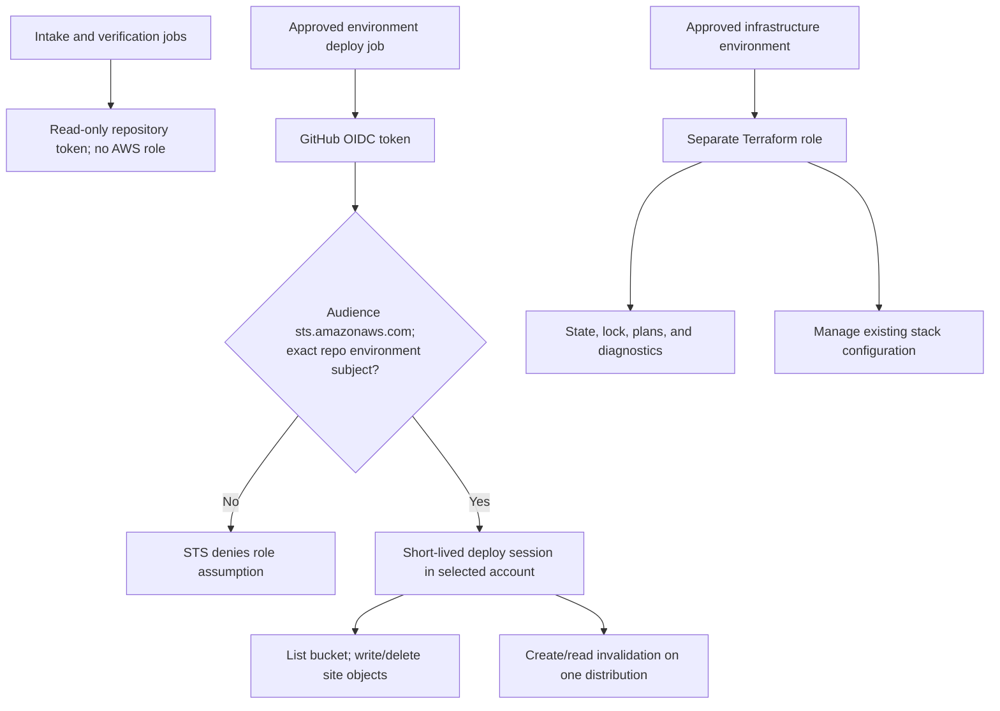

The deploy trust subject is `repo:Yale-Undergraduate-Consulting-Group/club-res-website:environment:<dev|prod>`. Terraform trusts only `infrastructure-<target>-plan` and `infrastructure-<target>-apply` subjects.

The subject names an environment, not a branch. GitHub environment branch policies must enforce `dev` for dev deployment and `prod` for prod deployment and infrastructure jobs. Without those settings, the trust boundary is incomplete.

The deploy role cannot apply Terraform or read state. It can list the site bucket, publish/delete current site objects, abort multipart uploads, and invalidate its distribution. It has no permission to delete historical object versions.

The Terraform role is privileged. It updates bucket policies, CloudFront configuration, IAM role policies, and related stack settings. Its normal resource permissions omit many create/delete APIs, so initial provisioning and replacement use operator credentials. This is **not** a general sandbox: IAM-policy modification can expand access. Owner review is essential.

No long-lived AWS access key is required in GitHub. GitHub environment variables contain target identifiers, not AWS secret keys.

Source: [`github.tf`](../terraform/github.tf), [environment proposals](../github/).

## 9. Infrastructure changes use reviewed saved plans

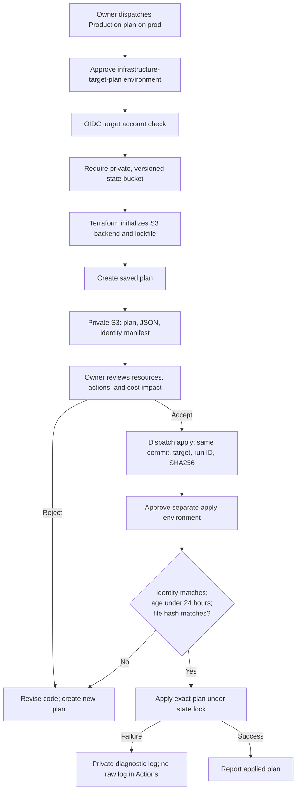

The manifest binds repository, commit, account, region, target, state bucket, and state key. A changed commit or expired plan requires a new review.

State objects and locks use separate permissions:

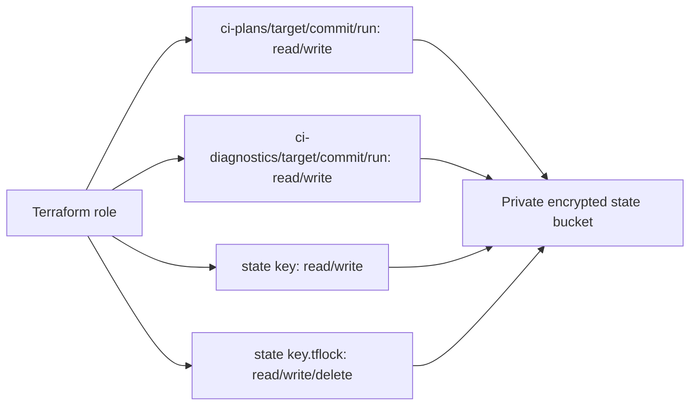

Plan JSON and state can contain secrets. Neither belongs in Git or public Actions artifacts. The summary lists resource addresses and actions, not full plan values. Init/plan/apply failures attempt to store diagnostic logs privately; upload can also fail.

The 24-hour apply window is **not** a deletion policy. The stack does not manage state-bucket lifecycle or automatically delete saved plans and logs. Bootstrap must define their retention and access policy.

Terraform apply returns after CloudFront accepts a configuration update; distribution propagation can continue. Application deployment separately waits for its invalidation and checks the live index.

Source: [`terraform-release.sh`](../scripts/terraform-release.sh), [`main.tf`](../terraform/main.tf), [`production.yml`](../.github/workflows/production.yml).

## 10. Data has distinct stores and deletion semantics

### Public website content moves from source to edge cache

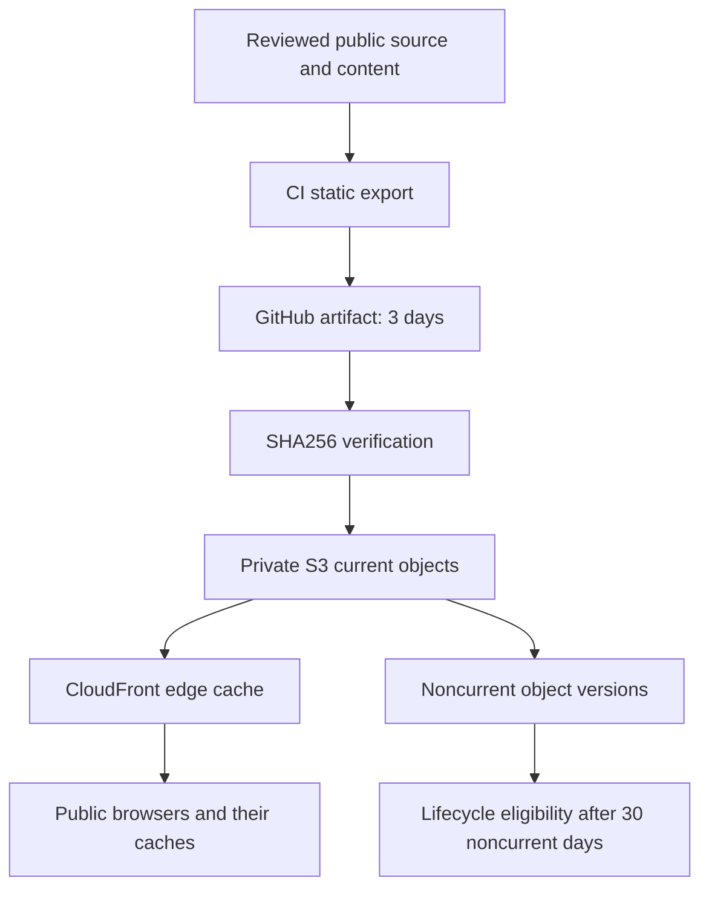

A private origin does not make delivered content private. Anything bundled into HTML, JavaScript, JSON, source maps, or public assets can reach a browser. Never put credentials, NDA documents, or client records in the static export.

| Store | Data | Access and retention |
|---|---|---|
| GitHub repository | Code, public content, review history | Repository permissions; deletion from a branch does not erase Git history |
| GitHub run logs | Build/test output and deployment summaries | Repository permissions and GitHub retention settings; application scripts must not print secrets |
| GitHub site artifact | Packaged public website and checksum | Explicit 3-day retention |
| Dependency caches | npm/pip packages, image layers, Terraform provider downloads | GitHub cache policy; never use as a secret or client-data store |
| Site S3 current objects | Public static export | OAC reads through CloudFront; deploy role writes; no current-object expiry |
| Site S3 noncurrent objects | Replaced or deleted revisions | Versioning; eligible for expiration after 30 noncurrent days |
| CloudFront/browser caches | Previously delivered public bytes | Cache controls and invalidation; client copies cannot be recalled |
| Separate state S3 bucket | Terraform state, plan binaries/JSON, manifests, diagnostics | Private bootstrap-managed bucket; retention not configured by this stack |
| Client application data | No supported store | Not implemented; do not upload confidential data here |

### S3 protections preserve history without making deletion immediate

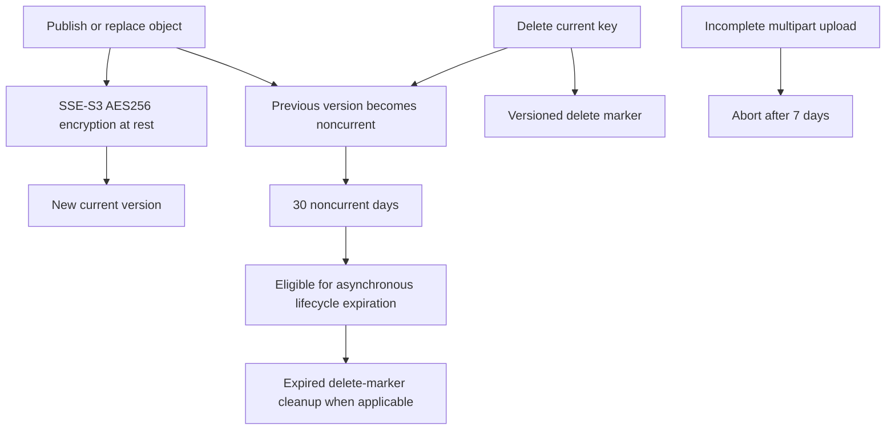

S3 blocks public ACLs and public bucket policies; bucket-owner-enforced ownership disables ACLs. The bucket policy permits CloudFront reads only for this distribution ARN and denies insecure transport.

Terraform uses `prevent_destroy` and disables force destruction for the site bucket. These protect ordinary Terraform operations, not every possible privileged AWS action.

Lifecycle timing is asynchronous. Thirty days means time since a version became noncurrent, not a guaranteed deadline since upload. Removing a page and invalidating CloudFront does not erase old S3 versions, Git history, downloaded artifacts, or browser copies.

### Immutable assets and pages use different cache rules

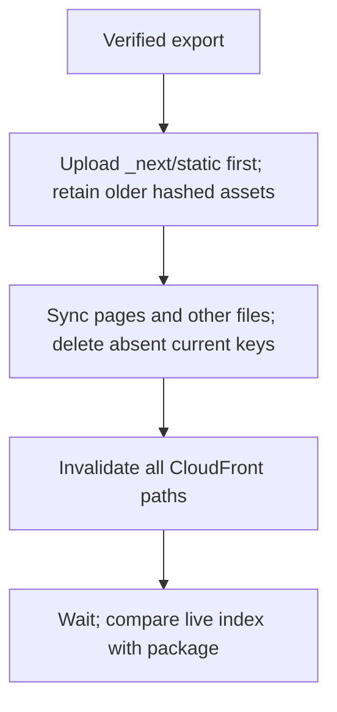

Hashed assets use `public,max-age=31536000,immutable`. Pages use browser revalidation with a long shared-cache lifetime, then deployment invalidates the edge cache.

Old hashed assets remain current S3 objects because deployment excludes that prefix from deletion. The noncurrent-version lifecycle does not remove them. This preserves open browser sessions but can grow storage; no current-asset cleanup is implemented.

## 11. Recovery and operations need explicit evidence

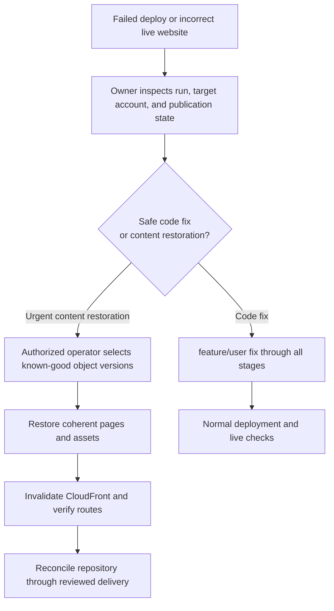

This recovery diagram is an operator procedure, not an automated rollback workflow. Recovery credentials and an exercised restoration drill are prerequisites for production use.

| Failure | Result | Next action |
|---|---|---|
| Local build/test fails | Intake stops | Fix the contributor branch |
| AWS static export or Terraform check fails | Integration does not advance to dev | Add compatibility changes through Intake |
| Review/hold/current-base rule blocks | No eligible promotion | Resolve the brake; synchronize source with destination; rerun checks |
| AWS variable missing | Deployment fails before AWS calls | Configure the exact environment |
| Backend runtime changed | Deployment fails: backend host absent | Implement backend hosting before releasing backend changes |
| Upload or invalidation fails | Publication may be partial | Inspect S3 and CloudFront before retry or restoration |
| Index differs | Deployment fails despite HTTP availability | Inspect caching and content; do not record a successful release |
| Dev deployment evidence missing | Production promotion stops | Deploy that exact dev commit or prove the complete diff is documentation-only |
| Plan identity/hash/age differs | Apply stops | Create and review a new plan |

No uptime alarm, synthetic monitor, CloudFront access-log destination, central audit trail, or application error telemetry is provisioned here. AWS service metrics and account audit facilities require an operations review; do not infer alerting from a green deployment.

Branches can diverge after merge commits. An owner can create `feature/sync` from `integration` and merge the destination history into it. That branch follows Intake and the normal reviewed sequence. Do not open a direct `prod → integration` PR: Intake rejects that source. No controller bypass exists.

## 12. Cost controls avoid an always-on application server

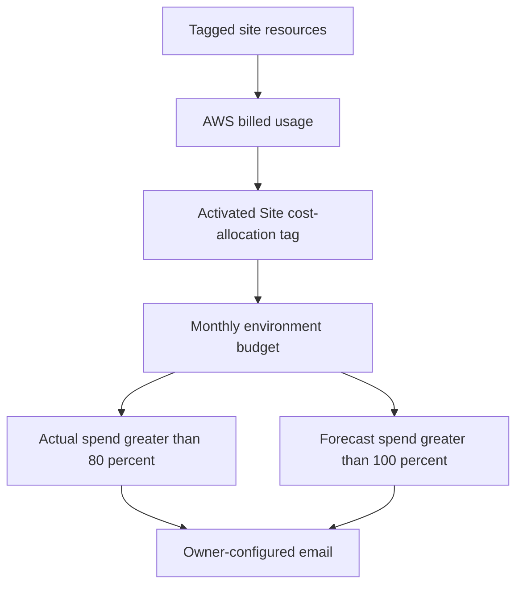

Budget notices are not spending limits. Billing data and notices can lag. The tag-filtered budget is not an account-wide cap and may miss untagged or unattributed costs. Activate the `Site` cost-allocation tag in each account.

| Choice | Benefit | Cost or limitation |
|---|---|---|
| Static S3 + CloudFront | No idle application instance or NAT gateway | Storage, requests, transfer, invalidations, and edge function usage still cost money |
| Separate accounts | Clear deployment and data boundaries | Two resource sets and operational setup |
| No WAF yet | Avoid fixed web ACL/rule overhead for static-only content | Reassess before adding forms, APIs, or application attack surfaces |
| SSE-S3 rather than a customer key | No dedicated KMS key for public content | Not a client-data key-isolation design |
| `PriceClass_100` | Limit edge locations | Some users can see higher latency |
| Cheap Intake | No Docker, Terraform, or Playwright | Cloud incompatibility can surface later, intentionally |
| Strict downstream checks | Test the deployment contract before release | Repeated builds and scans consume runner minutes |
| Cached dependencies/layers | Reduce repeated downloads and builds | Caches do not prove correctness or artifact integrity |
| No scheduled Actions | No periodic runner cost from these workflows | No continuous drift/uptime verification |

Every job has a bounded timeout. Documentation changes skip costly lanes. CloudFront invalidation waiting still consumes runner time. No measured monthly AWS or CI cost estimate is claimed.

## 13. Bootstrap requires an owner, plan support, and a real application

1. Enable GitHub support for organization rulesets and the required private-repository environment protections.
2. Have an organization owner review and merge this bootstrap PR into the current default branch, `main`.
3. Create `integration`, `dev`, and `prod` from that reviewed commit before installing creation restrictions.
4. Change the repository default branch to `prod` so trusted completion workflows load protected controller code.
5. Install the four `*.org-ruleset.proposed.json` payloads through the organization rulesets API.
6. Create each proposed environment and its matching branch policy through the repository environment APIs.
7. Verify a non-owner cannot create or update a branch outside `feature/*`.
8. Verify owners still need checks and review to merge into shared branches.
9. Create the dev and prod AWS accounts and private, encrypted, versioned state buckets.
10. Define retention, access controls, and recovery procedures for those state buckets.
11. Run initial Terraform provisioning with operator credentials, separately for each account.
12. Configure GitHub environment variables from verified account IDs and Terraform outputs.
13. Activate billing tags and confirm budget email delivery.
14. Integrate the real frontend through `feature/<user>`; complete the dev and prod deployment drills.

These are activation steps, not actions already performed. This PR does not create AWS accounts, change the default branch, install rules, or merge itself.

### Environment bindings

| Environment | Allowed ref | Required variables |
|---|---|---|
| `dev` | `dev` | `AWS_REGION`, `AWS_ACCOUNT_ID`, `AWS_DEPLOY_ROLE_ARN`, `SITE_BUCKET`, `CLOUDFRONT_DISTRIBUTION_ID`, `SITE_URL` |
| `prod` | `prod` | Same variable names, distinct prod values |
| `infrastructure-dev-plan`, `infrastructure-dev-apply` | `prod` | `AWS_TERRAFORM_ROLE_ARN`, `TF_REGION`, `TF_ACCOUNT_ID`, `TF_STATE_BUCKET`, `TF_STATE_KEY`, `TF_BUDGET_EMAIL`, `TF_MONTHLY_BUDGET_USD` |
| `infrastructure-prod-plan`, `infrastructure-prod-apply` | `prod` | Same variable names, distinct prod values |

`TF_MANAGE_GITHUB_OIDC_PROVIDER` is optional. Set it to `false` when the account already has the GitHub OIDC provider. Plan and apply bindings must match exactly.

Run Terraform with `environment=dev` or `environment=prod`. The [Terraform outputs](../terraform/outputs.tf) supply bucket, distribution, URL, and role identifiers. Use distinct state keys and accounts.

Install organization rules through `POST /orgs/Yale-Undergraduate-Consulting-Group/rulesets`, not the repository ruleset endpoint. Each environment payload and its branch-policy payload require separate API calls. Verify the returned settings; checked-in JSON does not prove enforcement.

The current CODEOWNER is the sole verified organization owner. Owner-authored PRs may need another eligible owner reviewer. Do not weaken protections to bypass that staffing requirement. Environment self-review remains allowed for the sole-owner setup; admin bypass remains disabled.

### Features not implemented by this static stack

| Capability | Status and prerequisite |
|---|---|
| Application frontend | Not included in this repository yet; downstream gates deliberately reject missing executable delivery |
| Backend hosting | Not implemented; backend changes cannot ship |
| Login, sessions, member roles | Not implemented; a public static URL is not authentication |
| NDA/client isolation and uploads | Not implemented; requires an authenticated data service and authorization tests |
| Database and client-data retention | Not implemented; requires explicit stores, deletion behavior, backup policy, and deletion evidence |
| Bedrock/model integration | Not implemented; enterprise model-data policy is separate from this delivery design |
| Custom domain | Planned extension only; requires DNS and ACM configuration |
| Automated rollback and continuous monitoring | Not implemented; exercise operator recovery before production use |

Do not interpret these gaps as permission to send confidential data through the public site. No placeholder service or mock deployment fills these roles.
