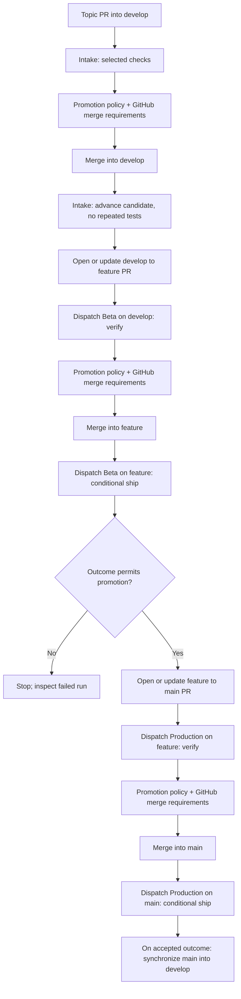
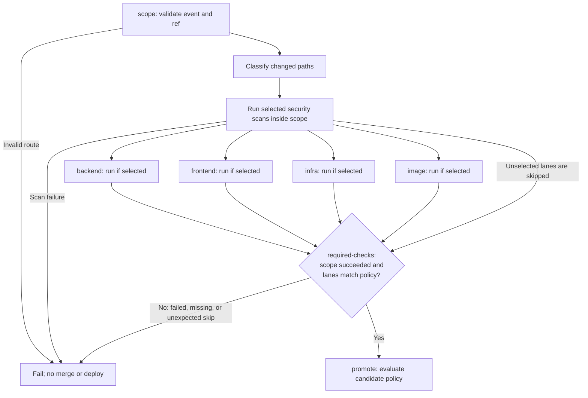
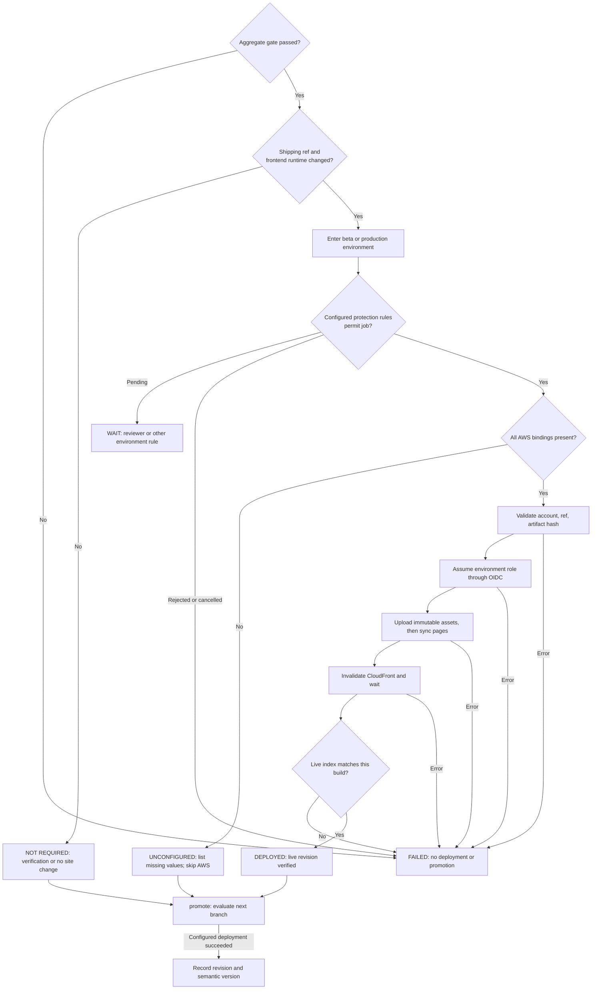
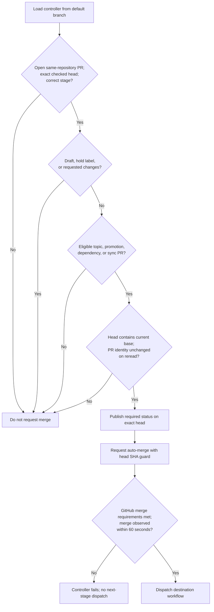
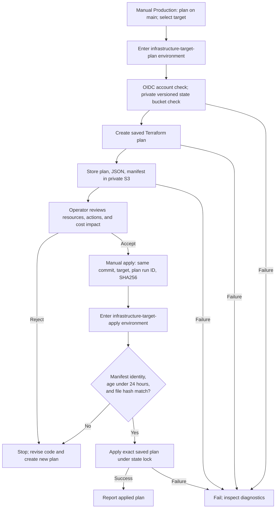

# Delivery pipeline

This document maps the implemented GitHub Actions workflows. It separates verification, deployment, promotion, and infrastructure operations.

**A green check does not prove deployment.** Missing AWS bindings currently permit promotion without deployment. See [deployment outcomes](#4-deployment-has-four-distinct-outcomes).

The implemented branch path is `topic → develop → feature → main`. This document does not change branch policy. The earlier requested `feature/* → dev → main` path differs from this implementation.

## 1. Each event selects one operation

| Workflow | Event and ref | Operation | Required check | AWS access |
|---|---|---|---|---|
| Intake | Same-repository PR into `develop`; manual run outside `develop` | Verify selected lanes | `intake-required-checks` | None |
| Intake | Push or manual run on `develop` | Advance candidate; no repeated tests | `intake-required-checks` | None |
| Beta | Manual run on `develop` | Verify candidate for `feature` | `feature-required-checks` | None |
| Beta | Push or manual run on `feature` | Build and conditionally ship site | `feature-required-checks` | Dev account, environment `beta` |
| Production | Manual `deliver` on `feature` | Verify candidate for `main` | `production-required-checks` | None |
| Production | Push or manual `deliver` on `main` | Build and conditionally ship site | `production-required-checks` | Prod account, environment `production` |
| Production | Manual `plan` or `apply` on `main` | Infrastructure only | No application check | Selected account, separate environment |

Beta rejects refs other than `develop` and `feature`. Production delivery rejects refs other than `feature` and `main`. Intake rejects fork PRs.

Source: [`intake.yml:33–62`](../.github/workflows/intake.yml#L33-L62), [`beta.yml:31–55`](../.github/workflows/beta.yml#L31-L55), [`production.yml:48–83`](../.github/workflows/production.yml#L48-L83).

## 2. Verification precedes merge; deployment follows merge

Each verification must pass before the controller requests a merge. Section 5 expands the promotion policy and stop paths.

The controller explicitly dispatches workflows after its merges. It does not depend on token-generated push events starting another workflow.

**Current exception:** an unconfigured deployment counts as an accepted outcome. Beta deployment is therefore not a mandatory prerequisite for production promotion.

Source: [`promote.py:54–77`](../scripts/promote.py#L54-L77), [`promote.py:165–210`](../scripts/promote.py#L165-L210), [`beta.yml:193–238`](../.github/workflows/beta.yml#L193-L238).

## 3. Verification runs parallel lanes, then one aggregate gate

The diagram shows logical stages, not extra runners. Security runs inside `scope`; `required-checks` remains a separate job.

| Lane | Verification work | Selection |
|---|---|---|
| Security, inside scope | Workflow lint, secret and configuration scans; Python dependency/code scans when present | Non-documentation changes |
| Backend | Install dependencies and run pytest; Intake excludes slow tests | `backend/`, shared control changes, or Production verification |
| Frontend | Locked install, lint, dependency audit, static export | `frontend/`, shared control changes, or Production verification |
| Infrastructure | Controller tests, shell syntax, Terraform format/validate/test | `terraform/`, `tests/`, `github/`, shared control changes, or Production verification |
| Image | Backend image build, Trivy scan, isolated import smoke | `backend/` changes in Beta or Production verification |

Shared control changes include `.github/`, `scripts/`, and unknown paths. They select backend, frontend, infrastructure, and security checks.

Production verification selects all non-image lanes for any executable change. Its image lane still requires a backend change. Frontend UI tests run only when `test:ui` exists.

Documentation-only changes select no lanes. The gate accepts those skips, but still requires `scope` success. Absent application directories can produce successful no-work verification; that does not prove application behavior.

**Ship runs differ:** they select only the frontend build when a `frontend/` path changed. They do not repeat lint, audit, backend, image, or infrastructure checks.

Source: [`ci_policy.py:42–87`](../scripts/ci_policy.py#L42-L87), [`frontend/action.yml:17–85`](../.github/actions/frontend/action.yml#L17-L85).

## 4. Deployment has four distinct outcomes

Environment approval applies only when GitHub has the corresponding protection rules. Proposed environment files do not install these rules.

| Evidence | Location or behavior |
|---|---|
| Static site artifact | `club-site-<commit SHA>`; `site.tar.gz` and `SHA256SUMS`; retained for 3 days |
| Artifact identity | Deploy compares the archive with the frontend job's SHA256 and the packaged manifest |
| Public revision | HTTP response must match the packaged `index.html` |
| Deployment outcome | `promote` writes the run summary; unexpected deployment failures/skips stop advancement |
| Release record | Controller records the revision/version after promotion processing, only for a configured successful deployment |

Beta and Production rebuild separately. They do **not** promote one immutable artifact across accounts. The hash proves integrity within each ship run, not identity across environments.

There is no automatic rollback. S3 publication is not atomic. A failed invalidation or live check can follow a partial publication.

Source: [`ship/action.yml:10–79`](../.github/actions/ship/action.yml#L10-L79), [`frontend/action.yml:86–105`](../.github/actions/frontend/action.yml#L86-L105), [`production.yml:161–266`](../.github/workflows/production.yml#L161-L266).

## 5. Promotion checks candidate identity and human brakes

Hold labels are `hold`, `do-not-merge`, and `release:hold`. The controller stops when a review page reaches its limit. Dependabot PRs must change only allowed dependency files.

The controller does not require a positive human approval itself. GitHub rulesets must enforce any required review. Ordinary eligible topic PRs can enter auto-merge.

Branch advancement also checks the current branch SHA. It synchronizes history into `develop` when the source trails its destination. It stops when there is nothing to advance. It does not recreate a recently closed, unmerged candidate with the same head.

Source: [`promote.py:124–210`](../scripts/promote.py#L124-L210). Required rulesets live in [`github/`](../github/) as proposals, not active settings.

## 6. Infrastructure uses a separate reviewed plan

Configured environment protections run before each environment job. Plan and apply do not build or deploy the application.

The manifest binds the plan to repository, commit, account, region, target, state bucket, and state key. A changed commit needs a new plan.

The Terraform role can update existing resources only. Initial provisioning, creation, replacement, and deletion require operator credentials. Budget alerts do not block spending. Operators must assess cost changes during plan review.

The script stores Terraform init/plan/apply failure logs in private S3 when possible. It does not print those logs into Actions.

Source: [`production.yml:267–306`](../.github/workflows/production.yml#L267-L306), [`terraform-release.sh:7–69`](../scripts/terraform-release.sh#L7-L69).

## 7. Failure handling keeps checks separate from recovery

| Condition | Current result | Operator action |
|---|---|---|
| Verification lane fails | Gate fails; no merge or deploy | Fix the candidate; run verification again |
| New topic PR commit arrives | Older Intake PR run cancels | Use checks for the new head |
| Hold, draft, requested changes, or stale candidate | Controller does not request merge | Resolve the brake; verify the current candidate |
| Merge not observed within 60 seconds | Controller fails without dispatching the next stage | Inspect PR state before rerunning |
| Environment approval pending | Environment job waits | Review the candidate and target |
| AWS variables missing | AWS steps skip; promotion remains permitted | Configure the environment before treating the run as deployment evidence |
| Upload, invalidation, or live check fails | No successful release record; site may already have changed | Inspect S3 and CloudFront; recover the intended revision |
| Saved plan stale or identity differs | Apply fails | Create and review a new plan |

A cancelled run does not execute the normal promotion outcome path. Inspect the GitHub run conclusion rather than expecting a final summary.

## 8. Release-readiness gaps remain explicit

These are missing controls or unproven behavior, not implemented gates. Model-provider enterprise security is outside this pipeline change.

| Area | Current state | Required before relying on it |
|---|---|---|
| Branch policy | Implemented `topic → develop → feature → main` differs from the earlier request | Resolve the branch model before bootstrap |
| Deployment prerequisite | Missing bindings permit advancement | Decide whether configured Beta deployment must block production promotion |
| Human review | Controller respects brakes; GitHub settings remain proposals | Install and verify rulesets and environment protections |
| Application behavior | Application code is not included; some verification paths allow absence | Integrate the application and exercise real routes |
| UI coverage | Missing `test:ui` succeeds with a notice | Define required critical-path UI coverage |
| Backend delivery | Tests and image checks only | Select a backend host and implement deployment plus health checks |
| Client isolation | No dedicated cross-client authorization gate | Add behavior tests for allowed and forbidden access when the application exists |
| Retention | Site artifact retention is 3 days; this is not client-data retention | Implement and verify deletion across application stores and backups |
| Recovery | No automatic rollback or atomic site switch | Define and exercise recovery before production use |

## AWS layout and setup

Use one dev account and one prod account in the AWS Organization. Each hosts private S3 plus CloudFront with Origin Access Control.

| Binding | Dev account | Prod account |
|---|---|---|
| Site environment | `beta` | `production` |
| Infrastructure environments | `infrastructure-beta-plan`, `infrastructure-beta-apply` | `infrastructure-production-plan`, `infrastructure-production-apply` |
| GitHub credentials | Environment-bound OIDC roles | Environment-bound OIDC roles |
| Cost notice | AWS Budget email alert | AWS Budget email alert |

The roles trust the repository's exact environment subject. No static AWS access key is needed in GitHub.

1. Resolve the branch-policy difference before bootstrap.
2. Merge the pipeline into `main`; its controllers load from the default branch.
3. For the implemented branch model, create `develop` and `feature` from `main`.
4. Create both AWS accounts and a Terraform state bucket in each.
5. Initialize Terraform with the target backend configuration. Run the first apply with operator credentials.
6. Use `environment=beta` for dev and `environment=production` for prod.
7. Activate the `Site` cost allocation tag in each account's Billing settings.
8. Create GitHub environments from `github/*.proposed.json`; configure protections and variables.
9. Install the proposed rulesets and verify their required checks and review requirements.

If an account already has the GitHub OIDC provider, set `manage_github_oidc_provider=false`.

| Environments | Variables |
|---|---|
| `beta`, `production` | `AWS_REGION`, `AWS_ACCOUNT_ID`, `AWS_DEPLOY_ROLE_ARN`, `SITE_BUCKET`, `CLOUDFRONT_DISTRIBUTION_ID`, `SITE_URL` |
| `infrastructure-<target>-{plan,apply}` | `AWS_TERRAFORM_ROLE_ARN`, `TF_REGION`, `TF_ACCOUNT_ID`, `TF_STATE_BUCKET`, `TF_STATE_KEY`, `TF_BUDGET_EMAIL`, `TF_MONTHLY_BUDGET_USD`; optional `TF_MANAGE_GITHUB_OIDC_PROVIDER` |

Plan and apply variables must match. The frontend needs Next.js static export and `frontend/out/index.html`. CloudFront currently uses its default certificate, without custom-domain aliases.

## Cost controls do not add more workflow stages

- Scope combines routing, classification, and security scans in one runner.
- Selected verification lanes run in parallel; documentation changes skip all lanes.
- Intake builds the frontend when selected, but runs no Docker or Playwright.
- Beta and Production ship runs rebuild only a changed frontend.
- Outcome, promotion, and release recording share one job. The aggregate gate uses its own job.
- Dependency and image-layer caches reduce repeated work. Jobs have 5–15 minute timeouts; no workflow has a schedule.

Private-repository runner use depends on the plan allowance. Documentation-only verification still starts scope, required-checks, and promotion jobs. CloudFront invalidation waiting consumes runner time.

AWS cost depends on storage, traffic, requests, and invalidations. This document makes no monthly cost estimate. Budget alerts notify; they do not impose a hard spending cap.
