# Delivery, AWS architecture, and data lifecycle

## Status and reading order

**Branch sequence:** `feature/<user> → integration → dev → prod`.

Contributor work starts as a localhost-compatible application. The first merge needs no Terraform or AWS compatibility. Later gates require the AWS deployment contract, then production UI coverage and deployment evidence.

This repository also holds the YUCG Outreach application (`backend/`, `frontend/`, `docker/`), merged from the former `client-affairs-tools` repository, and the box scripts in `ops/`. Its runtime is one container on one EC2 instance per environment with SQLite on an encrypted volume, shipped by the same gates as the static site. **Dev is private**: no public URL, reached only through an SSM port-forward, and it may hold real client data when a feature needs it, but it never sends mail. **Prod** is the only environment with a public edge and live sending. Section 14 describes the runtime and its confidentiality limits.

| Status | Meaning in this document |
|---|---|
| Implemented in this PR | Workflow, script, or Terraform behavior exists in this repository |
| Proposed setting | A JSON file describes a GitHub setting; it does not install that setting |
| Not deployed | No successful AWS deployment has been verified for this repository |
| Not implemented | The architecture has no corresponding resource or application capability |

**Access enforcement is active as repository rulesets (installed 2026-10-02).** The organization is on the Free plan, so the organization rulesets in `github/*.org-ruleset.proposed.json` cannot be installed. The four rules run as repository rulesets with the same conditions and rules. Shared-branch reviews and `prod` / `infrastructure-*-apply` approvals require the team `club-res-website-maintainers`.

Still open: an organization owner must allow GitHub Actions to create pull requests (organization Settings → Actions). Until then the controller cannot open stage PRs.

**Maintainer** means a person with the repository **admin** role. Organization owners also qualify. This document names roles, not individuals: change who maintains the repository in GitHub settings, not in this file.

Organization-level rules need someone with permission to manage organization rulesets. After installation, day-to-day review and merging needs only a maintainer.

Read sections 1–5 for Actions and permissions; sections 6–12 for AWS, website operation, and data; section 13 for bootstrap; section 14 for the application runtime and confidentiality; section 15 for account vending. [EXTENSIONS.md](EXTENSIONS.md) lists planned extensions that are not implemented, such as a managed knowledge base.

## 1. Contributors enter through local checks

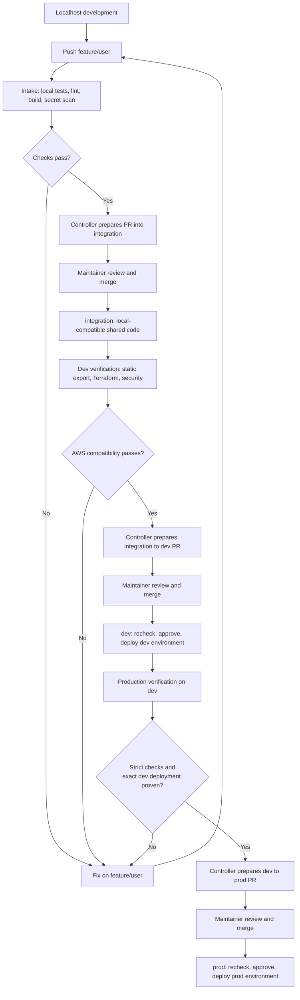

Each arrow across a shared branch requires a PR and a maintainer merge. Passing checks does not authorize a contributor to merge. The controller never merges or synchronizes branches.

The controller opens every stage PR as `github-actions[bot]`. A single maintainer can therefore approve and merge it; no second person is required.

Each contributor keeps **one** long-lived branch, `feature/<login>`, created once from `integration`. All their work is committed there. After a maintainer merges their PR, they merge `integration` back into the same branch and continue; the branch is never rebased or force-pushed. One branch per contributor keeps the branch list short and gives each person at most one open PR.

`feature/<user>` is a naming convention, not a parent-child Git relationship. Git cannot store both a branch named `feature` and branches named `feature/user`; this is why the shared local branch is `integration`.

Branches do not change code automatically to make it cloud-compatible. AWS-specific changes return through a contributor branch when the Dev gate fails.

Source: [stage workflows](../.github/workflows/), [`ci_policy.py`](../scripts/ci_policy.py), [`promote.py`](../scripts/promote.py).

## 2. Rules restrict shared-branch writes to maintainers

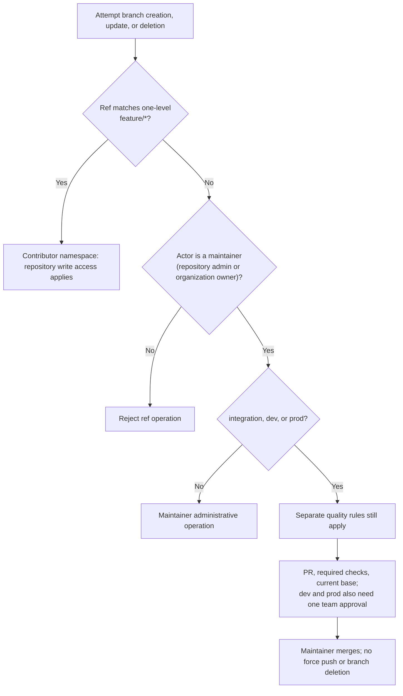

This diagram describes the installed rules. They are repository rulesets on `club-res-website`.

| Setting | Purpose | Bypass |
|---|---|---|
| `contributor-namespace.org-ruleset.proposed.json` | Restrict creation, update, and deletion of every branch outside `feature/*` | Repository admin role and organization owners |
| `integration.org-ruleset.proposed.json` | Require Intake and current base; no approval | None |
| `dev.org-ruleset.proposed.json` | Require Dev checks, one maintainer-team approval, and current base | None |
| `prod.org-ruleset.proposed.json` | Require Production checks, one maintainer-team approval, and current base | None |
| Environment proposals | Restrict each environment to its deployment ref | Admin bypass disabled |

A repository ruleset does **not** stop a repository admin from editing or deleting the restriction. Organization rulesets would, but they need a paid GitHub plan. The bypass is a role, so adding or removing a maintainer needs no rule edit. The restriction has no write-role, deploy-key, or GitHub Actions bypass.

PRs into `integration` need no approval: only maintainers can merge there, so the maintainer's merge is the review, and a single maintainer can merge their own PR. PRs into `dev` and `prod` need one approval from `club-res-website-maintainers`. The controller opens those promotion PRs as `github-actions[bot]`, so one maintainer can approve them. No code owner is required.

Because only bypass actors may update `integration`, `dev`, and `prod`, GitHub shows every PR into them as **blocked**, even when every check passes. That is expected. A maintainer merges with **Merge without waiting for requirements to be met (bypass rules)**, or `gh pr merge <n> --merge --admin`. The quality rulesets have no bypass actors, so their checks and approvals are still required.

Keep `require_extra_approval_for_unattributed_changes: false` in every `pull_request` rule. GitHub sets it to `true` when a payload omits it. It then demands a human approval for agent-authored commits even when no approval is required, which blocked PR #8.

The namespace rule permits contributors to use any allowed `feature/*` branch. It does **not** prove that `feature/alice` belongs to Alice or prevent another writer from updating it. Personal branch isolation would require per-user rules or separate forks.

Contributors need repository **write**, not admin, access. Names cannot restrict local branches or branches in another repository. Fork PRs are outside the implemented Intake route.

Scheduled Dependabot updates were removed: its generated branch names would violate this namespace. Dependency updates use a reviewed `feature/<user>` branch instead. A bot exemption would need a separate policy decision.

GitHub references: [organization ruleset API](https://docs.github.com/en/rest/orgs/rules#create-an-organization-repository-ruleset), [repository ruleset API](https://docs.github.com/en/rest/repos/rules#create-a-repository-ruleset).

## 3. Each stage adds a specific compatibility requirement

| Requirement | Intake: contributor → integration | Dev: integration → dev | Production: dev → prod |
|---|---|---|---|
| Frontend | Locked install, **unit tests (`npm run test:unit`)**, lint, dependency audit, ordinary build | Same checks plus `frontend/dist/index.html` static export | Same checks plus required `test:ui` |
| Backend | Full pytest suite (`backend/scripts/test_suite.py`): branch coverage, 80% floor on critical modules | Same | Same |
| Container image | None | Build for `linux/amd64`, Trivy HIGH/CRITICAL scan, non-root import smoke with no network, for runtime changes; every deployment rebuilds and rescans | Same |
| Terraform | **Not installed or validated** | Format, validate, mocked plan tests | Same checks repeated |
| Source scanning | Workflow lint, secrets, Python audit/code scan when present | Adds configuration misconfiguration scan | Same checks repeated |
| Cloud credentials during verification | None | None | None |
| Deployment after merge | None | Environment `dev` in the shared account | Environment `prod` in the shared account |
| Missing frontend | Can be no-work if no frontend exists | Blocks executable changes | Blocks executable changes |
| Missing AWS bindings | Not relevant | Blocks deployment | Blocks deployment |
| Backend deployment | Not relevant | Image pushed to ECR and the box restarted by digest through SSM; automatic rollback on a failed health check | Same, then the public site is published and checked through CloudFront |

Intake does not require Docker, static export, Terraform, or cloud credentials. A Terraform-only Intake change still gets secret scanning but no Terraform compatibility gate.

Unit tests cannot be skipped by omission. Any change to a workflow, action, script, test, `docker/`, or `.dockerignore` reruns every unit-test lane at every stage, and the aggregate `*-required-checks` status fails when a selected lane did not succeed. A frontend change without unit tests fails because Vitest exits non-zero when it finds none.

Dev and Production check all non-image lanes for every non-documentation change. The image lane requires a runtime path change (`frontend/`, `backend/`, `docker/`, `ops/`, `.dockerignore`). Ship runs retain these checks; they do not replace verification with a build-only shortcut.

Documentation-only changes skip application and Terraform lanes and do not deploy. Renaming application code into `docs/` does not qualify for the controller's documentation-only deployment exception.

### Event routing

| Workflow | Trigger/ref | Operation |
|---|---|---|
| Intake | Push `feature/*`; manual run on that ref; same-repository PR into `integration` from `feature/*` | Verify local contract |
| Dev | Push/manual `integration`; PR into `dev` from `integration` | Verify AWS compatibility; no AWS credentials |
| Dev | Push/manual `dev` | Recheck, build artifact, deploy dev if executable changes exist |
| Production | Manual `deliver` on `dev`; PR into `prod` from `dev` | Verify strict production contract |
| Production | Push/manual `deliver` on `prod` | Recheck, build artifact, deploy prod if executable changes exist |
| Production | Manual `plan` or `apply` on `prod` | Infrastructure only, target `dev` or `prod` |
| Promotion | Successful completion of Intake, Dev, or Production | Evaluate trusted run evidence; prepare PR or dispatch verification |

Unsupported refs and PR source branches fail routing. New contributor pushes and PR runs can cancel older checks. Deployment runs do not cancel an active deployment.

### Selected checks converge at one gate

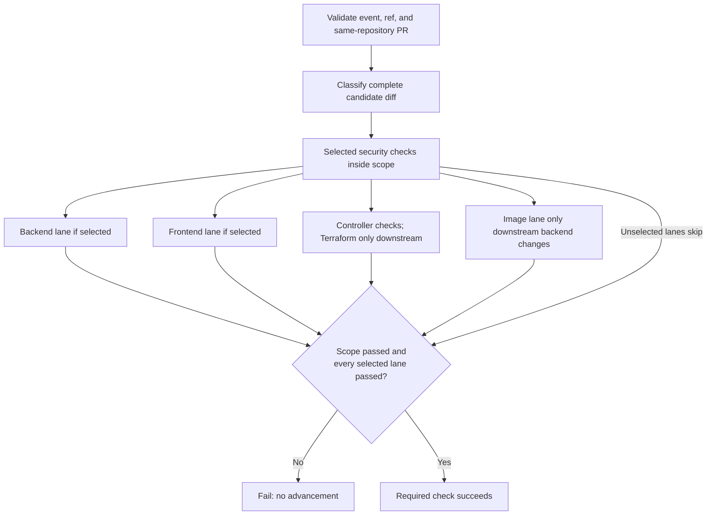

Verification compares the complete candidate with its destination branch, not only its latest push. Shipping compares the push range, or the first parent on manual delivery.

Source: [`ci_policy.py`](../scripts/ci_policy.py), [composite actions](../.github/actions/).

## 4. Trusted completion code prepares PRs, never merges

The controller has write permissions because it creates PRs, statuses, and production releases. It never checks out candidate code, runs candidate scripts, or downloads candidate artifacts.

A successful Dev deployment dispatches Production verification on `dev`. The Production candidate must have a successful Dev deployment job for its exact SHA, unless the complete `prod…dev` diff contains only documentation.

The Production required check enforces this evidence too. Opening a production PR manually does not bypass the deployment prerequisite. Any workflow in this repository can post a status with the required context, so the environment-gated production deploy job proves the evidence again itself: the second parent of the merge commit on `prod` must have a successful dev deployment, or the deploy fails before any AWS call.

Hold labels are `hold`, `do-not-merge`, and `release:hold`. Drafts, requested changes, recently closed unmerged candidates, stale source heads, and candidates whose destination holds file changes they lack stop advancement. Oversized evidence pages fail closed or stop automatic advancement.

GitHub-generated PR events do not reliably start workflows when the controller uses `GITHUB_TOKEN`. Source pushes already perform Intake and Dev verification. The controller explicitly dispatches Production verification and publishes the verified status on the exact PR head.

Observed 2026-10-07: the Intake `pull_request` run on a controller-opened PR ends in failure with no jobs, no check runs and no annotations, while the Intake `push` run on the same commit succeeds and supplies the required `intake-required-checks`. The Dev workflow's run on a controller-opened PR succeeded, so the cause is not simply the bot actor, and it is unexplained. Gating is unaffected, because the ruleset reads the check run on the commit, not the event that produced it. Treat a red `pull_request` Intake run on a controller PR as noise only after confirming the push run passed.

**Destination commits that change no files do not block a promotion.** PR merge commits land on `dev` and `integration` and never flow back, so the destination routinely holds commits its source lacks. The controller compares the destination against the source (`compare/<source>...<destination>`); when that comparison lists no changed files, the extra commits are history only, cannot change what the candidate's checks tested, and the PR opens anyway. GitHub then marks it behind its base, which changes nothing in practice: only maintainers can merge into these branches, and they merge with bypass. When the comparison lists files, or cannot prove there are none (a missing or non-list `files`), the controller prints "Admin must synchronize ... then verify again." and stops: merge the destination branch into the source first (section 11).

Maintainer review remains essential: contributor code can modify its own proposed checks. Protected shared refs and organization rules form the enforcement boundary, not workflow names alone.

A successful production deployment creates a semantic-version release for the **deployed SHA**, not the controller checkout SHA. Documentation-only changes create no deployment release. Repeating a release reuses the existing release for that commit.

| Label on any PR merged since the previous release | Version change |
|---|---|
| `release:major` | `X.0.0`: full or breaking release |
| `release:minor` | `0.X.0`: new feature |
| `release:patch`, or no label | `0.0.X`: fix or small change |

Contributors label their own `feature/<user>` PRs. The release uses the largest label among all merged PRs since the previous release, so promotion PRs need no relabeling. The first release is `v0.1.0`.

Source: [`promotion.yml`](../.github/workflows/promotion.yml), [`promote.py`](../scripts/promote.py), [`release_version.py`](../scripts/release_version.py).

## 5. Deployment fails closed before publication

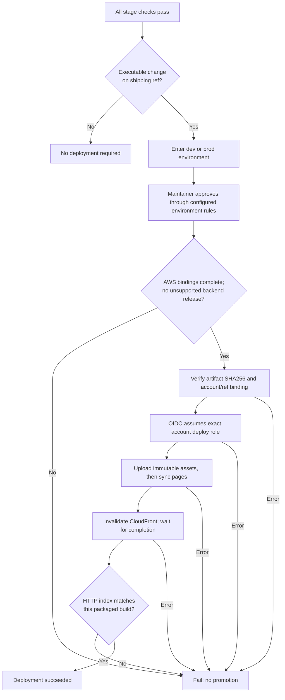

This approval step exists only after the GitHub environment protections have been installed. A YAML environment name alone does not enforce review.

| Evidence | Contract |
|---|---|
| Package | `club-site-<commit SHA>` contains `site.tar.gz` and `SHA256SUMS` |
| Retention | GitHub retains the site artifact for 3 days |
| Integrity | Deploy checks both the frontend job's expected hash and the manifest |
| Account | AWS credentials action restricts the allowed account ID |
| Revision | Public `index.html` must match the packaged file byte-for-byte |
| Production prerequisite | Successful Dev deployment job for the exact candidate SHA |

Dev and Prod build separately. Hash checking proves integrity within a run; it does not prove identical bytes across accounts.

The live check covers the index only. It does not prove every route, dependency, authorization rule, or browser interaction. Required production UI tests must supply that application coverage.

Publication is not atomic. A failure after S3 writes can leave some new content live. There is no automatic rollback.

### Backend runtime deployment

When a `backend/`, `docker/`, or `ops/` path changes, the ship job deploys the container before it publishes any page:

1. Verify the image artifact's SHA256, then push it to the environment's ECR repository as `<sha>-<run id>` (tags are immutable).
2. Run `ops/check_deployment.py`: the instance selected by tag `Site=club-res-website-<env>` must equal `BOX_INSTANCE_ID`, require IMDSv2, have no `0.0.0.0/0` ingress, and have only encrypted volumes.
3. Send `ops/restart-yucg.sh` to that instance with `ssm:SendCommand` (`AWS-RunShellScript`), by image digest. The script takes an online SQLite backup, regenerates `/etc/yucg/app.env` from Secrets Manager and `/etc/yucg/config.json`, starts the container, checks `/api/health` on the box, and restarts the previous digest if the check fails.
4. Prod only: publish `frontend/dist` to S3, invalidate CloudFront, compare the live index, and require `{"status":"ok"}` from `SITE_URL/api/health`.

Dev has no CloudFront: it skips step 4 and relies on the on-box health check. Shipping the image and the pages are separate steps, so a failure between them can leave new pages talking to the previous API version. Keep API changes backward compatible for one release.

Source: [`frontend/action.yml`](../.github/actions/frontend/action.yml), [`ship/action.yml`](../.github/actions/ship/action.yml).

## 6. One AWS account hosts dev and prod

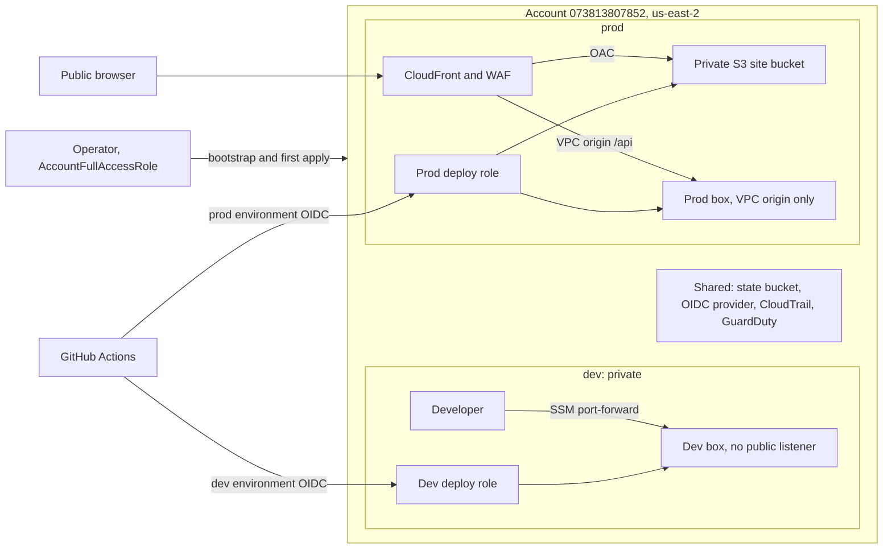

Dev and prod run in **one** account, `073813807852`. This replaces the earlier plan of separate dev and prod accounts: creating accounts needs an organization's management account, and nobody who runs this pipeline has one. Each environment has its own Terraform state key, VPC, box, buckets, KMS key, secrets, ECR repository, IAM roles, and budget, all named `club-res-website-<env>`.

**What the shared account separates, and what it does not.** Each environment's GitHub roles trust only that environment's OIDC subject, and their policies name that environment's resources or require `aws:ResourceTag/Site = club-res-website-<env>`. That alone is not enough: each Terraform role may rewrite its own inline policy and those of its environment's other roles (`ManageStackRoles`), so a reviewed dev apply could grant itself prod access. A **permissions boundary**, `club-res-website-<env>-boundary`, is therefore attached to every role. It denies any action on resources named or tagged for the other environment, including the other environment's Terraform state and saved plans, and the roles cannot remove or edit it. Changing the boundary needs operator credentials. So no dev role, deploy or Terraform, can reach prod, and the reverse. This was checked with `iam simulate-custom-policy` against both environments' ARNs; a Terraform test fails if any role lacks the boundary.

People are the remaining gap: anyone with administrator access to the account can reach both environments, and the organization that owns the account keeps its control over it. Section 15 moves the environments to separate accounts when the club controls an organization.

**Dev is private.** It has no CloudFront distribution and its security group allows no inbound traffic. Developers reach it with `aws ssm start-session --document-name AWS-StartPortForwardingSession`, which is IAM-authenticated and logged in CloudTrail. Dev may contain real client data when a feature under development needs it. Copy only the tables the feature needs, as a deliberate and logged operation; never run a standing sync from prod. Dev must never send mail: it runs with `EMAIL_DELIVERY_ENABLED=false`, its own `JWT_SECRET` (so Gmail tokens copied from prod cannot be decrypted), and no Gmail tokens in any copied table.

| AWS feature | Design choice and consequence | Source |
|---|---|---|
| One shared account | One bootstrap, one set of audit controls; environments separated by name, role scope, VPC, KMS key, and `Site` tag | Environment inputs in [`main.tf`](../terraform/main.tf), role policies in [`github.tf`](../terraform/github.tf) |
| Region | `us-east-2` for everything except CloudFront, ACM, WAF-for-CloudFront, KMS, IAM, and Bedrock cross-region routing. The account's organization decides which regions its policies allow | [`main.tf`](../terraform/main.tf) |
| S3 origin | Private regional S3 endpoint; not S3 public website hosting | [`cloudfront.tf`](../terraform/cloudfront.tf) |
| CloudFront | HTTPS delivery for pages and `/api`, compression, HTTP/2 and HTTP/3, IPv6; prod only | [`cloudfront.tf`](../terraform/cloudfront.tf) |
| CloudFront VPC origin | The API box has no public listener; only the CloudFront service security group can reach port 80 | [`cloudfront.tf`](../terraform/cloudfront.tf), [`network.tf`](../terraform/network.tf) |
| Origin Access Control | CloudFront signs origin requests to S3 with SigV4 | [`cloudfront.tf`](../terraform/cloudfront.tf) |
| WAF | AWS managed Common and Known Bad Inputs rule groups plus an IP rate rule on the prod distribution | [`cloudfront.tf`](../terraform/cloudfront.tf) |
| Response headers | Custom policy: HSTS, nosniff, frame deny, referrer policy, CSP | [`cloudfront.tf`](../terraform/cloudfront.tf) |
| IAM OIDC provider | Short-lived AWS sessions, exact repository/environment trust; created once per account by `scripts/bootstrap-account.sh` | [`github.tf`](../terraform/github.tf) |
| Permissions boundary | Every role is capped to its own environment; the other environment's resources and state are denied by name and `Site` tag | [`github.tf`](../terraform/github.tf) |
| Role separation | Site and image publisher versus privileged reviewed Terraform operator | [`github.tf`](../terraform/github.tf) |
| S3 state locking | Terraform 1.10+ S3 lockfile; no DynamoDB table | [`main.tf`](../terraform/main.tf) |
| Customer-managed KMS key | One key per environment for client-data stores: EBS data volume, catalog, backups, secrets | [`security.tf`](../terraform/security.tf) |
| Lifecycle | Noncurrent history expiration, multipart cleanup, delete-marker cleanup | [`storage.tf`](../terraform/storage.tf) |
| AWS Budgets | Email notices for tagged actual and forecast spend | [`budget.tf`](../terraform/budget.tf) |

Each environment has a dedicated VPC, one EC2 instance, a data volume with `prevent_destroy`, and no NAT gateway. Section 14 lists what that leaves exposed.

## 7. Browsers receive static pages from S3 and the API from the app box

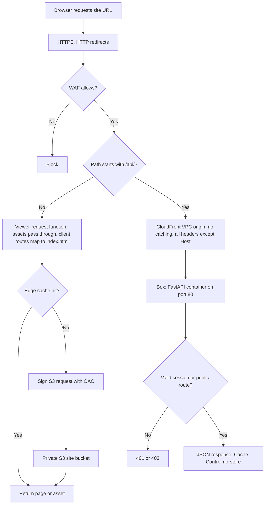

Node runs during CI builds, not in AWS at request time. The frontend is a Vite single-page application: the build output is `frontend/dist`, published to S3. Client-side routes resolve to `index.html`; hashed files under `assets/` pass through unchanged. There is no server-side rendering. Sessions, authorization, and all data access live in the API behind `/api/*`, which CloudFront never caches.

| Request path | Served from |
|---|---|
| `/` and any client route | `index.html` from S3 |
| `/assets/file.js` | Unchanged object from S3 |
| `/api/*` | The app box through the CloudFront VPC origin |

The function treats a path with a dot in its last segment as a file and everything else as a client route; `/api/*` never reaches it. Public pages stay up when the box is stopped; `/api/*` then returns a gateway error and the login page must show that the tools are offline.

CloudFront uses `PriceClass_100` to limit edge-location cost exposure. This is a geography/performance tradeoff, not a monthly cost cap. No geographic access restriction is configured.

### Custom domain is a separate, not-yet-implemented change

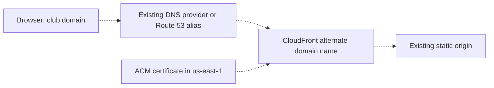

Dashed arrows describe a planned extension only. The current Terraform has no aliases or ACM certificate. A custom domain needs certificate validation, DNS, aliases, and a reviewed TLS policy change. DNS can remain with an existing provider.

## 8. OIDC separates code checks from AWS permissions

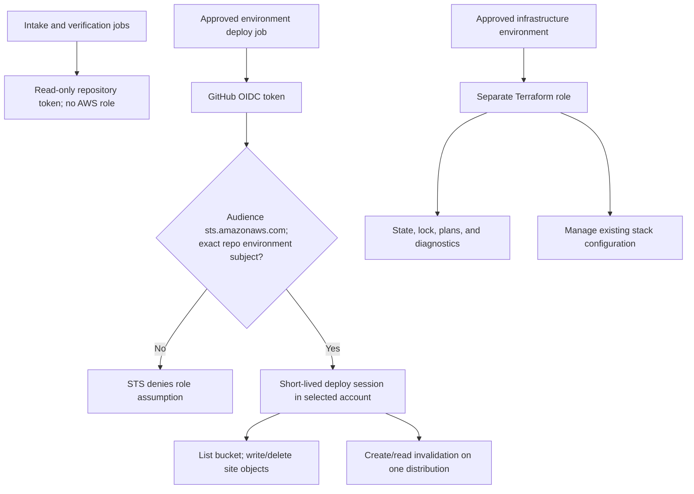

The deploy trust subject is `repo:Yale-Undergraduate-Consulting-Group@264275789/club-res-website@1401667698:environment:<dev|prod>`: GitHub issues this immutable form (owner and repository IDs) to repositories created after 2026-07-15, and a trust written as `owner/name` never matches their tokens, which is how the first Dev deploy failed. Terraform trusts only `infrastructure-<target>-plan` and `infrastructure-<target>-apply` subjects, in the same form. Look the IDs up with `gh api repos/<owner>/<repo> --jq '.owner.id, .id'`; `terraform-release.sh` computes them from `GITHUB_REPOSITORY_OWNER_ID` and `GITHUB_REPOSITORY_ID`.

The subject names an environment, not a branch. GitHub environment branch policies must enforce `dev` for dev deployment and `prod` for prod deployment and infrastructure jobs. Without those settings, the trust boundary is incomplete.

The deploy role cannot apply Terraform or read state. It can list the site bucket, publish/delete current site objects, abort multipart uploads, and invalidate its distribution. It has no permission to delete historical object versions.

The Terraform role is privileged. It updates bucket policies, CloudFront configuration, IAM role policies, and related stack settings. Its normal resource permissions omit many create/delete APIs, so initial provisioning and replacement use operator credentials. Rewriting a role's policy can expand access **within its own environment**; the permissions boundary stops it at the other environment. Maintainer review is essential.

No long-lived AWS access key is required in GitHub. GitHub environment variables contain target identifiers, not AWS secret keys.

Source: [`github.tf`](../terraform/github.tf), [environment proposals](../github/).

## 9. Infrastructure changes use reviewed saved plans

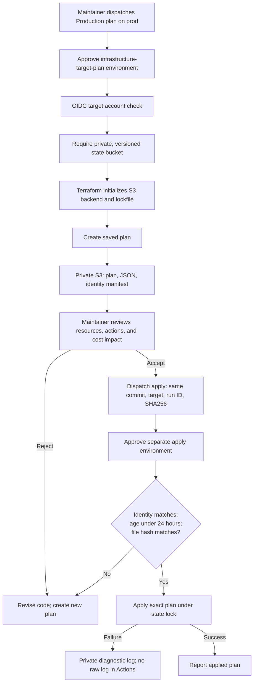

The manifest binds repository, commit, account, region, target, state bucket, and state key. A changed commit or expired plan requires a new review.

State objects and locks use separate permissions:

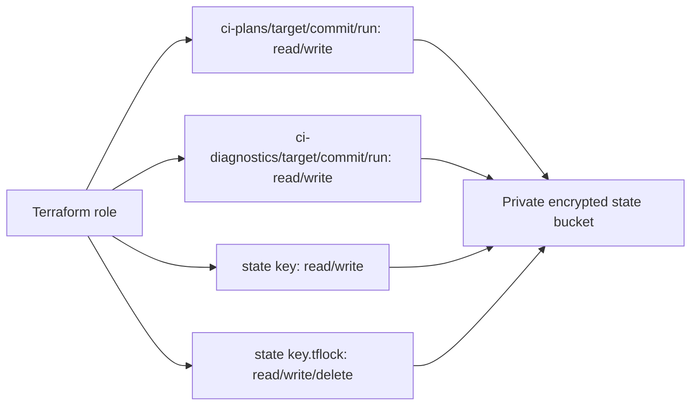

Plan JSON and state can contain secrets. Neither belongs in Git or public Actions artifacts. The summary lists resource addresses and actions, not full plan values. Init/plan/apply failures attempt to store diagnostic logs privately; upload can also fail.

The 24-hour apply window is **not** a deletion policy. The stack does not manage state-bucket lifecycle or automatically delete saved plans and logs. Bootstrap must define their retention and access policy.

Terraform apply returns after CloudFront accepts a configuration update; distribution propagation can continue. Application deployment separately waits for its invalidation and checks the live index.

Source: [`terraform-release.sh`](../scripts/terraform-release.sh), [`main.tf`](../terraform/main.tf), [`production.yml`](../.github/workflows/production.yml).

## 10. Data has distinct stores and deletion semantics

### Public website content moves from source to edge cache

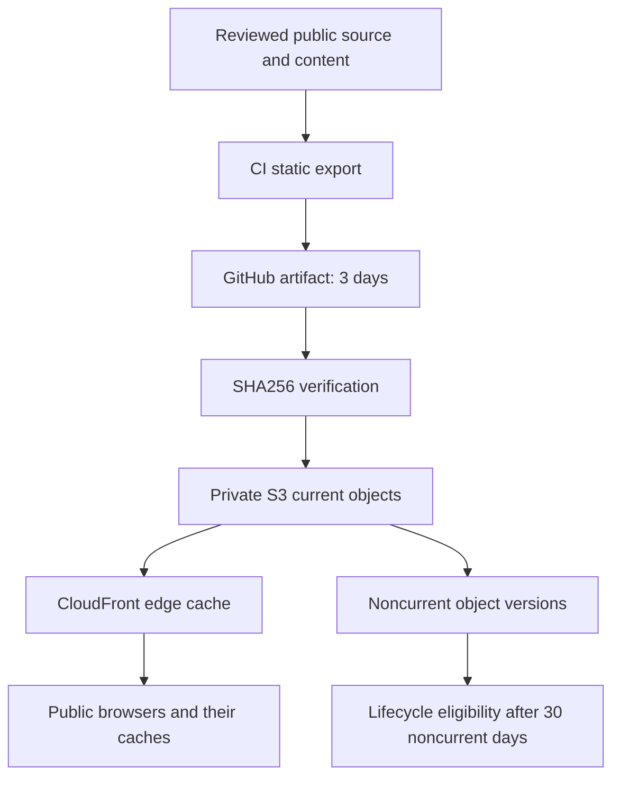

A private origin does not make delivered content private. Anything bundled into HTML, JavaScript, JSON, source maps, or public assets can reach a browser. Never put credentials, NDA documents, or client records in the static export.

| Store | Data | Access and retention |
|---|---|---|
| GitHub repository | Code, public content, review history | Repository permissions; deletion from a branch does not erase Git history |
| GitHub run logs | Build/test output and deployment summaries | Repository permissions and GitHub retention settings; application scripts must not print secrets |
| GitHub site artifact | Packaged public website and checksum | Explicit 3-day retention |
| Dependency caches | npm/pip packages, image layers, Terraform provider downloads | GitHub cache policy; never use as a secret or client-data store |
| Site S3 current objects | Public static export | OAC reads through CloudFront; deploy role writes; no current-object expiry |
| Site S3 noncurrent objects | Replaced or deleted revisions | Versioning; eligible for expiration after 30 noncurrent days |
| CloudFront/browser caches | Previously delivered public bytes | Cache controls and invalidation; client copies cannot be recalled |
| Separate state S3 bucket | Terraform state, plan binaries/JSON, manifests, diagnostics | Private encrypted bucket created by `scripts/bootstrap-account.sh`; saved plans and diagnostics expire after 30 days, noncurrent state versions after 90 days |
| Catalog S3 bucket | Client contacts, exports, discovery data | KMS customer-managed key, versioned, TLS-only, object access only through the VPC's S3 endpoint; noncurrent versions expire after 30 days |
| Documents S3 bucket | Member documents uploaded and downloaded by browsers through presigned URLs | Same key, versioning, and lifecycle; browsers cannot use the VPC endpoint, so object access is limited to the box role (the signer of every presigned URL) and listed operator roles instead; CORS admits only the site origin |
| SQLite data volume | The club database, `DATABASE_URL=sqlite:////data/clientreach.db` | Encrypted EBS with the environment key, `prevent_destroy`, daily snapshots (7 retained) |
| Backups S3 bucket | SQLite `.backup` snapshots written before each deploy and daily | KMS key, versioned; never a raw copy of a live `.db` file |
| Secrets Manager secret | `JWT_SECRET`, OAuth client secrets, API tokens | Values seeded by `scripts/seed-secrets.sh`, never in Terraform state or Git |
| Audit trail | CloudTrail management events, multi-region, log-file validation | Private log bucket, 400-day expiry |

### S3 protections preserve history without making deletion immediate

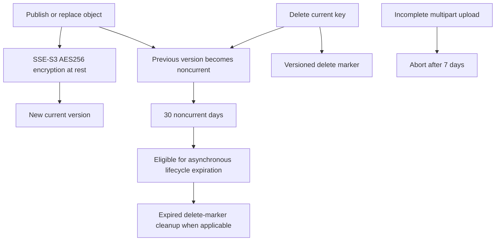

S3 blocks public ACLs and public bucket policies; bucket-owner-enforced ownership disables ACLs. The bucket policy permits CloudFront reads only for this distribution ARN and denies insecure transport.

Terraform uses `prevent_destroy` and disables force destruction for the site bucket. These protect ordinary Terraform operations, not every possible privileged AWS action.

Lifecycle timing is asynchronous. Thirty days means time since a version became noncurrent, not a guaranteed deadline since upload. Removing a page and invalidating CloudFront does not erase old S3 versions, Git history, downloaded artifacts, or browser copies.

### Immutable assets and pages use different cache rules

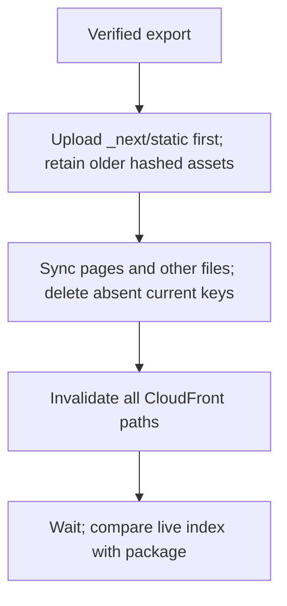

Hashed assets use `public,max-age=31536000,immutable`. Pages use browser revalidation with a long shared-cache lifetime, then deployment invalidates the edge cache.

Old hashed assets remain current S3 objects because deployment excludes that prefix from deletion. The noncurrent-version lifecycle does not remove them. This preserves open browser sessions but can grow storage; no current-asset cleanup is implemented.

## 11. Recovery and operations need explicit evidence

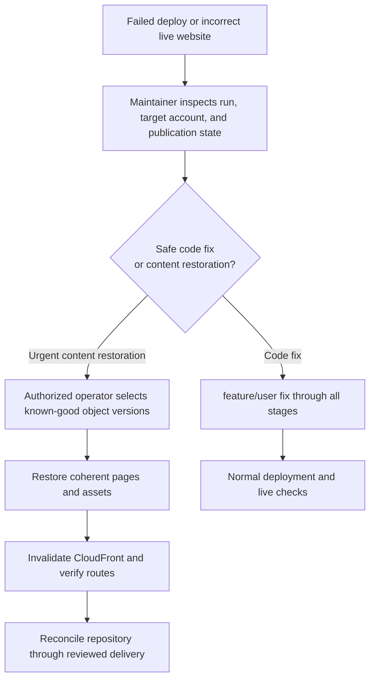

This recovery diagram is an operator procedure, not an automated rollback workflow. Recovery credentials and an exercised restoration drill are prerequisites for production use.

| Failure | Result | Next action |
|---|---|---|
| Local build/test fails | Intake stops | Fix the contributor branch |
| AWS static export or Terraform check fails | Integration does not advance to dev | Add compatibility changes through Intake |
| Review/hold/current-base rule blocks | No eligible promotion | Resolve the brake; synchronize source with destination; rerun checks |
| AWS variable missing | Deployment fails before AWS calls | Configure the exact environment |
| Backend runtime changed | Ship fails if the image push, SSM command, or box health check fails; the box restarts the previous image digest | Read the SSM command output, fix forward on a `feature/<user>` branch, and redeploy |
| Upload or invalidation fails | Publication may be partial | Inspect S3 and CloudFront before retry or restoration |
| Index differs | Deployment fails despite HTTP availability | Inspect caching and content; do not record a successful release |
| Dev deployment evidence missing | Production promotion stops | Deploy that exact dev commit or prove the complete diff is documentation-only |
| Plan identity/hash/age differs | Apply stops | Create and review a new plan |

No uptime alarm, synthetic monitor, CloudFront access-log destination, central audit trail, or application error telemetry is provisioned here. AWS service metrics and account audit facilities require an operations review; do not infer alerting from a green deployment.

Branches can diverge when the destination receives real file changes, for example a hotfix applied directly. A maintainer can create `feature/sync` from `integration` and merge the destination history into it. That branch follows Intake and the normal reviewed sequence. Do not open a direct `prod → integration` PR: Intake rejects that source. No controller bypass exists. History-only divergence needs no sync (section 4).

## 12. Cost controls bound the always-on application server

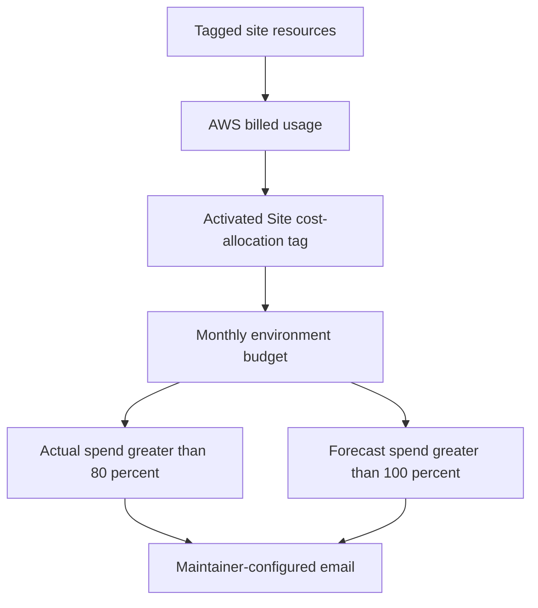

Budget notices are not spending limits. Billing data and notices can lag. The tag-filtered budget is not an account-wide cap and may miss untagged or unattributed costs. Activate the `Site` cost-allocation tag once in the shared account; each environment's budget then counts only its own tag.

| Choice | Benefit | Cost or limitation |
|---|---|---|
| One small instance per environment, no NAT gateway | Lowest fixed cost for a shared, always-on API | The instance and its public IPv4 bill continuously; stop the instance (host-control Lambda) when unused |
| One shared account | One bootstrap and audit trail; no management account needed | Administrators of the account reach both environments |
| WAF on the prod edge | Blocks common attacks before they reach the API | Fixed web ACL and rule charges |
| Customer-managed KMS key per environment | Key isolation for EBS, catalog, backups, and secrets | About $1 per key per month; the public site bucket stays on SSE-S3 |
| `PriceClass_100` | Limit edge locations | Some users can see higher latency |
| Cheap Intake | No Docker, Terraform, or Playwright | Cloud incompatibility can surface later, intentionally |
| Strict downstream checks | Test the deployment contract before release | Repeated builds and scans consume runner minutes |
| Cached dependencies/layers | Reduce repeated downloads and builds | Caches do not prove correctness or artifact integrity |
| No scheduled Actions | No periodic runner cost from these workflows | No continuous drift/uptime verification |

Every job has a bounded timeout. Documentation changes skip costly lanes. CloudFront invalidation waiting still consumes runner time. No measured monthly AWS or CI cost estimate is claimed.

## 13. Bootstrap requires plan support, a maintainer, and a real application

1. Enable GitHub support for organization rulesets and the required private-repository environment protections.
2. Have a maintainer review and merge this bootstrap PR into the current default branch, `main`.
3. Create `integration`, `dev`, and `prod` from that reviewed commit before installing creation restrictions.
4. Change the repository default branch to `prod` so trusted completion workflows load protected controller code.
5. Install the four `*.org-ruleset.proposed.json` payloads through the organization rulesets API. This step needs organization-ruleset permission.
6. Create each proposed environment and its matching branch policy through the repository environment APIs.
7. Add the current maintainers as required reviewers on `prod` and both `infrastructure-*-apply` environments.
8. Verify a write-role contributor cannot create or update a branch outside `feature/*`.
9. Verify maintainers still need passing checks to merge into all three shared branches, plus one team approval for `dev` and `prod`.
10. Use the shared account `073813807852` for both environments (section 6). Creating separate accounts needs an organization's management account; section 15 covers that later move.
11. Run `scripts/bootstrap-account.sh <region>` once in the account with operator credentials: it creates the private state bucket with retention, the GitHub OIDC provider, a multi-region CloudTrail trail with its log bucket, and a GuardDuty detector. Both environments share them.
12. Run initial Terraform provisioning with operator credentials, once per environment, with its own state key (`club-res-website/<env>/terraform.tfstate`).
13. Configure GitHub environment variables from verified account IDs and Terraform outputs.
14. Activate billing tags and confirm budget email delivery.
15. Integrate the real frontend through `feature/<user>`; complete the dev and prod deployment drills.

Steps 3–7 were done on 2026-10-02: branches from `main` @ `bbd7385`, default branch `prod`, four repository rulesets, six environments with branch policies, team reviewers. Steps 8–9 need a write-role contributor to test. Steps 10–11 are done: on 2026-10-05 the account `073813807852` was bootstrapped in `us-east-2` (state bucket, OIDC provider, CloudTrail trail, GuardDuty detector). Steps 12–15 are not done: nothing has been applied by Terraform.

### Environment bindings

| Environment | Allowed ref | Required variables |
|---|---|---|
| `dev` | `dev` | `AWS_REGION`, `AWS_ACCOUNT_ID`, `AWS_DEPLOY_ROLE_ARN`, `ECR_REPOSITORY`, `BOX_INSTANCE_ID` |
| `prod` | `prod` | The same variables plus `SITE_BUCKET`, `CLOUDFRONT_DISTRIBUTION_ID`, `SITE_URL` |
| `infrastructure-dev-plan`, `infrastructure-dev-apply` | `prod` | `AWS_TERRAFORM_ROLE_ARN`, `TF_REGION`, `TF_ACCOUNT_ID`, `TF_STATE_BUCKET`, `TF_STATE_KEY`, `TF_BUDGET_EMAIL`, `TF_MONTHLY_BUDGET_USD` |
| `infrastructure-prod-plan`, `infrastructure-prod-apply` | `prod` | Same variable names. Same account, region, and state bucket as dev; prod's own role ARN, state key, and budget values |
| `organization-plan`, `organization-apply` | `prod` | `ORG_ACCOUNT_ID`, `AWS_ORGANIZATION_ROLE_ARN`, `ORG_DEV_EMAIL`, `ORG_PROD_EMAIL`, `ORG_STATE_BUCKET`, `ORG_STATE_KEY` |

Set `TF_MANAGE_GITHUB_OIDC_PROVIDER` to `false`: `scripts/bootstrap-account.sh` already created the provider. Plan and apply bindings must match exactly.

Optional `infrastructure-*` variables, each unset by default: `TF_INSTANCE_TYPE`, `TF_DATA_VOLUME_GB`, `TF_ENABLE_EDGE`, `TF_ENABLE_WAF`, `TF_ORIGIN_READ_TIMEOUT`, `TF_OFFICE_HOURS_ENABLED`, and `TF_CATALOG_OPERATOR_PRINCIPAL_ARNS` (a JSON list of role ARNs that may read catalog, documents, and backups from outside the VPC, such as a restore role). A value changed locally but not set here is reverted by the next reviewed plan.

Run Terraform with `environment=dev` or `environment=prod`. The [Terraform outputs](../terraform/outputs.tf) supply bucket, distribution, URL, and role identifiers. Use distinct state keys and accounts.

Install organization rules through `POST /orgs/Yale-Undergraduate-Consulting-Group/rulesets`, not the repository ruleset endpoint. Each environment payload and its branch-policy payload require separate API calls. Verify the returned settings; checked-in JSON does not prove enforcement.

Environment reviewers are not stored in this repository: GitHub requires user or team IDs, and those change with membership. Set them in GitHub settings. A GitHub team of maintainers keeps that list in one place.

After installing a ruleset, check that its bypass list shows **Repository admin**. The proposal uses `RepositoryRole` ID 5 for that role.

### Feature status and prerequisites

| Capability | Status and prerequisite |
|---|---|
| Application frontend and backend | In this repository; deployed by the gates above once the environments exist |
| Login, sessions, member roles | Implemented by the application (Google sign-in limited to `@yale.edu` plus an invitation); needs the Google OAuth client for each environment's URL |
| NDA/client isolation and uploads | Row-level and workspace isolation exist in the application; storage encrypted per environment; no external authorization test suite yet |
| Database and client-data retention | SQLite on an encrypted volume with snapshots and `.backup` copies; a deletion-evidence procedure and a restore drill are not done |
| Bedrock/model integration | Code and IAM exist; the account's Bedrock quotas are zero and the Anthropic use-case form is blocked by organization policy until the organization owner allows it |
| Custom domain | Planned extension only; requires DNS and ACM configuration |
| Automated rollback and continuous monitoring | Image rollback on a failed health check only; no uptime alarm or synthetic monitor |

Do not interpret these gaps as permission to send confidential data through the public site.

## 14. Application runtime and confidentiality limits

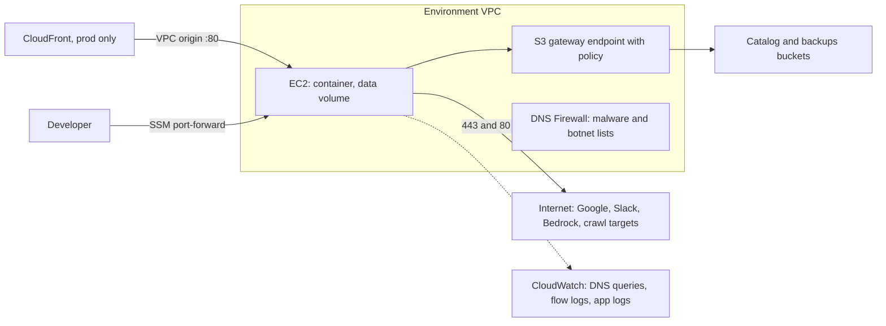

Controls that exist: no SSH and no inbound listener except the CloudFront service security group in prod; IMDSv2 required; security-group egress limited to ports 80, 443, 53, and 123; an S3 gateway endpoint whose policy admits only this environment's buckets; bucket policies that deny requests not arriving through that endpoint; DNS Firewall blocking AWS-managed malware and botnet domains; DNS query logs, VPC flow logs, CloudTrail, and GuardDuty; per-environment KMS keys; and no long-lived AWS credentials anywhere.

**Known limit: data can still leave over ports 80 and 443.** The application must crawl arbitrary company websites and resolve MX records for arbitrary recipient domains, so an egress domain allowlist would break the product. An attacker who controls the container can therefore reach arbitrary internet hosts. The mitigations are detection (DNS and flow logs, GuardDuty), minimal IAM, and the S3 endpoint policy, which stops uploads to buckets outside this environment. Revisit this with a filtering proxy if the crawl moves to a separate worker.

**Known limit: one instance, one disk.** A stopped or failed instance is a full outage of the API, and SQLite allows one writer. Recovery is the latest EBS snapshot or `.backup` copy; no restore drill has been performed yet. To scale, move to a larger instance type through a reviewed Terraform plan before considering another database.

## 15. Organization and account vending

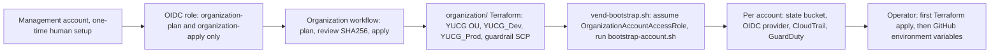

**Not in use.** Dev and prod share one account (section 6), so this workflow does not run and the `organization-*` environments stay unconfigured. It is kept for the move to separate accounts once the club controls an organization's management account. `organization/` is organization-agnostic: it names no organization, so that move is a new plan and apply with that management account, not a rewrite. It runs through the same reviewed saved-plan runner as `terraform/` (section 9), with the same identity manifest, 24-hour age limit, and SHA256 match, under the environments `organization-plan` and `organization-apply`.

Limits to know:

- A member account cannot create accounts, so the one-time prerequisites in [organization/README.md](../organization/README.md) need a person with management-account administrator access.
- Terraform never closes an account (`close_on_deletion = false`, `prevent_destroy`); closing one is a manual action by the organization owner.
- The workflow bootstraps each new account but does not set the GitHub environment variables: it prints them, and a maintainer adds them (the Actions token cannot write repository settings).
- The guardrail SCP is attached to the `YUCG` OU only. Policies attached higher in the host organization still apply and may deny actions this design needs; the owner of that organization controls them.
