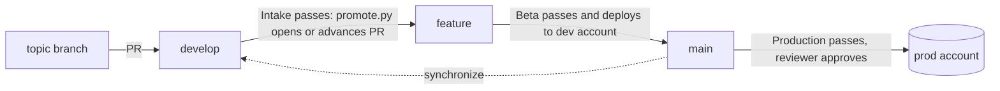
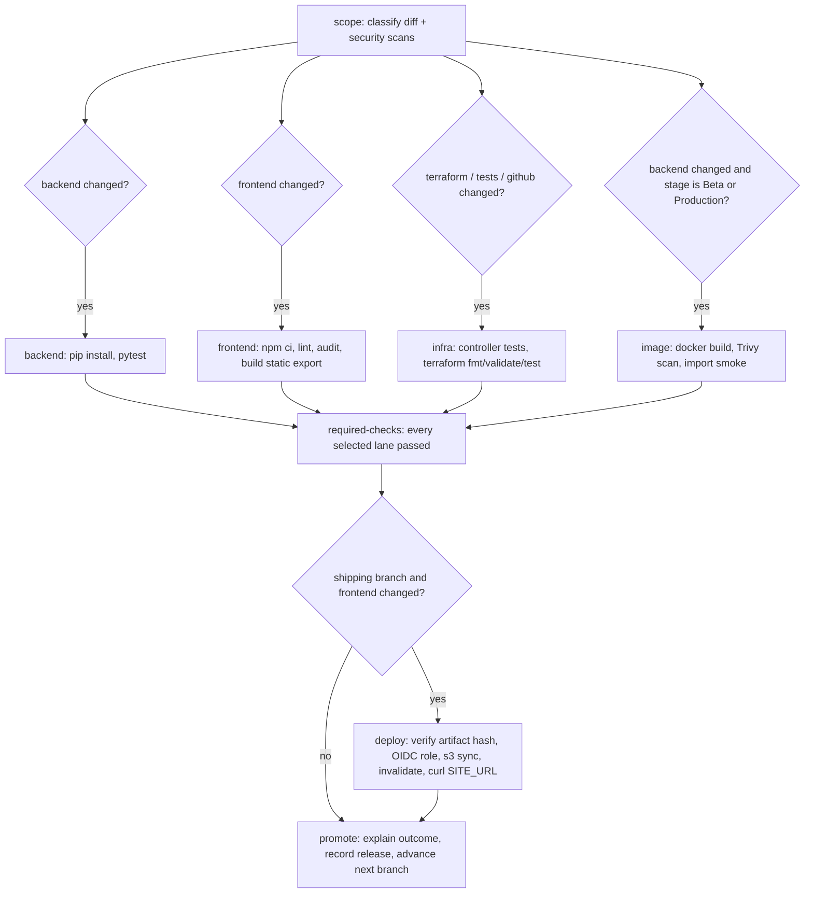
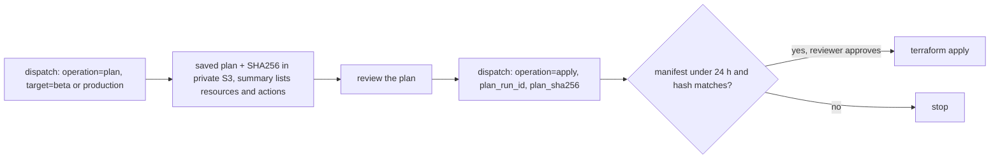

# Delivery pipeline

Three stage workflows move code from a topic branch to production. Each stage is one workflow that runs intake checks, processing (tests, builds), and shipping for its branch. The model is the same as `Andylol111/client-affairs-tools`.

| Stage | Workflow | Branch | Required check | Ships to |
|---|---|---|---|---|
| Intake | `.github/workflows/intake.yml` | topic → `develop` | `intake-required-checks` | nothing |
| Beta | `.github/workflows/beta.yml` | `develop` → `feature` | `feature-required-checks` | dev AWS account (environment `beta`) |
| Production | `.github/workflows/production.yml` | `feature` → `main` | `production-required-checks` | prod AWS account (environment `production`) |

## Branch flow

`scripts/promote.py` advances each branch after its stage passes. It always runs from `main`, never from candidate code. A PR with a `hold`, `do-not-merge` or `release:hold` label, a draft PR, or a PR with requested changes is not advanced.

## One stage run

All three workflows have the same shape. A stage selects only the lanes that the diff touches.

Lane rules (`scripts/ci_policy.py`):

- Documentation only (`docs/`, top-level `*.md`): no lanes run.
- `frontend/` → frontend lane. `backend/` → backend lane, plus image in Beta and Production. `terraform/`, `tests/`, `github/` → infra lane.
- Production verification runs every lane for any code change and adds `test:ui` (Playwright) when the frontend defines it.
- The backend is verified but not shipped. No backend host exists yet; the promote job states this when the backend changed.

## Infrastructure changes

Terraform changes never apply on push. An operator runs Production manually from `main`:

The Terraform role can update existing resources only. The first apply, and any change that creates, replaces or deletes a resource, runs with operator credentials.

## AWS layout

One account per environment, both in the AWS Organization:

| | dev account | prod account |
|---|---|---|
| GitHub environments | `beta`, `infrastructure-beta-{plan,apply}` | `production`, `infrastructure-production-{plan,apply}` |
| Site | private S3 bucket + CloudFront (Origin Access Control) | same |
| GitHub access | OIDC deploy role and Terraform role, trusted only for that environment | same |
| Cost guard | AWS Budget with email alerts | same |

No access keys are stored in GitHub. Each role trusts `repo:Yale-Undergraduate-Consulting-Group/club-res-website:environment:<name>` only.

## Cost

Runner minutes are billed for this private repository. The pipeline keeps them low:

- Intake has no Docker image, no image scan and no Playwright. PR runs cancel when a newer commit arrives.
- Routing, classification and security scans share one `scope` job. Gate, outcome, release and promotion share the `promote` job.
- The Docker image is built only in Beta and Production, and only when `backend/` changed. Layers, npm, pip and Terraform are cached.
- Every job has a 5–15 minute timeout. No workflow is scheduled.

The remaining cost per run:

- Each job bills at least 1 minute, so a docs-only PR costs about 3 minutes.
- Production verification runs every lane, plus a Playwright browser install that is not cached.
- Deploy waits 1–10 minutes for the CloudFront invalidation.

The AWS side for a static site costs cents per month at club traffic: S3 storage and CloudFront requests. Each account's budget alert catches surprises.

## Setup order

1. Bootstrap: merge the pipeline into `main` first. `promote.py` and `release_version.py` load from `main`. Then create `develop` and `feature` from `main`.
2. Create the dev and prod accounts in the Organization and a Terraform state bucket in each.
3. First apply per account with operator credentials: `terraform -chdir=terraform init -backend-config=...`, then `apply -var environment=beta` (or `production`). In a second environment that shares an account, set `-var manage_github_oidc_provider=false`.
4. Activate the `Site` cost allocation tag under Billing in each account, or the budget shows zero.
5. Create the GitHub environments from `github/*.proposed.json` and fill their variables:
   - `beta` and `production`: `AWS_REGION`, `AWS_ACCOUNT_ID`, `AWS_DEPLOY_ROLE_ARN`, `SITE_BUCKET`, `CLOUDFRONT_DISTRIBUTION_ID`, `SITE_URL` (Terraform outputs).
   - `infrastructure-<target>-{plan,apply}`: `AWS_TERRAFORM_ROLE_ARN`, `TF_REGION`, `TF_ACCOUNT_ID`, `TF_STATE_BUCKET`, `TF_STATE_KEY`, `TF_BUDGET_EMAIL`, `TF_MONTHLY_BUDGET_USD`, optional `TF_MANAGE_GITHUB_OIDC_PROVIDER`. Plan and apply values must match.
6. Apply the rulesets (`github/*ruleset*.proposed.json`) so the three required checks protect `develop`, `feature` and `main`.

Until step 5 is done, deploy jobs skip their AWS steps, and the promote job lists the missing variables.

The frontend must build as a static export (`output: 'export'` in `next.config.ts`, output in `frontend/out/`). A custom domain is a later change: CloudFront uses its default certificate and has no aliases.
